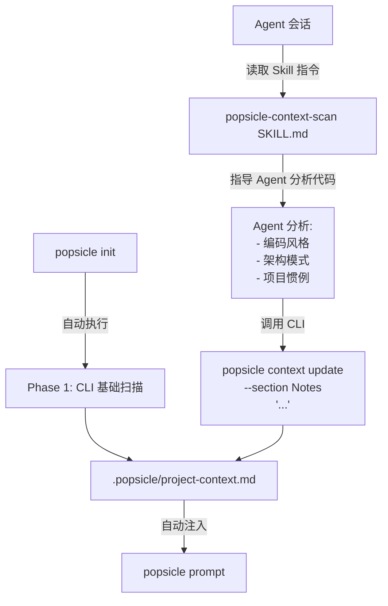

# Agent-Driven Project Context Deep Analysis

## 设计思路

当前 `popsicle context scan` 是纯文件系统检测（Phase 1）。用户需要的是 **Agent 在会话中分析代码后，调用 CLI 命令将分析结果持久化到 project-context.md**（Phase 2）。




核心原则：**CLI 负责存储，Agent 负责分析**（与 Auto-Memory 架构一致）。

## 1. 新增 `popsicle context update` 命令

**文件**: `[crates/popsicle-cli/src/commands/context.rs](crates/popsicle-cli/src/commands/context.rs)`

在 `ContextCommand` 枚举中新增 `Update` 子命令，允许 Agent 追加或替换 `project-context.md` 中的指定 section：

```rust
/// Update a section in project-context.md
Update(UpdateArgs),
```

```rust
struct UpdateArgs {
    /// H2 section name to update (e.g. "Notes", "Architecture Patterns")
    #[arg(long)]
    section: String,
    /// Content to write (reads from stdin if omitted)
    #[arg(long)]
    content: Option<String>,
    /// Append to existing section instead of replacing
    #[arg(long)]
    append: bool,
}
```

行为：

- 如果 section 已存在，替换该 section 的内容（`--append` 时追加）
- 如果 section 不存在，在 `## Notes` 之前插入新 section
- 如果 `project-context.md` 不存在，报错提示先运行 `popsicle context scan`

这让 Agent 可以执行：

```bash
popsicle context update --section "Architecture Patterns" --content "- Error handling: thiserror for library errors, anyhow for application errors\n- All public APIs have doc comments\n- Builder pattern for complex struct construction"
```

## 2. `popsicle init` 自动执行基础扫描

**文件**: `[crates/popsicle-cli/src/commands/init.rs](crates/popsicle-cli/src/commands/init.rs)`

在 builtin 安装完成后、Agent 指令生成前，自动调用 `ProjectScanner::scan()` 写入 `.popsicle/project-context.md`（仅在文件不存在时）：

```rust
let layout = ProjectLayout::new(&project_root);
let context_path = layout.project_context_path();
if !context_path.exists() {
    let scanner = ProjectScanner::new(&project_root);
    let content = scanner.scan();
    std::fs::write(&context_path, content)?;
}
```

这样已有项目重新 `popsicle init` 时也会生成 project context。

## 3. 新增 Agent Skill: `popsicle-context-scan`

**文件**: `[crates/popsicle-core/src/agent/mod.rs](crates/popsicle-core/src/agent/mod.rs)`

在 Agent 指令安装时，新增一个固定 Skill（类似现有的 `popsicle-next`），安装为 `.claude/skills/popsicle-context-scan/SKILL.md` 和 `.cursor/skills/popsicle-context-scan/SKILL.md`。

SKILL.md 内容指导 Agent：

```markdown
---
name: popsicle-context-scan
description: Analyze the project codebase and generate a rich technical profile. Use when starting work on a new project or when the project context seems incomplete.
---

Analyze the project's codebase to build a comprehensive technical profile.

## When to Use

- After `popsicle init` (project-context.md has basic info but lacks depth)
- When `.popsicle/project-context.md` is missing or sparse
- When `popsicle pipeline next` suggests updating project context

## Analysis Steps

1. Read `.popsicle/project-context.md` to see what's already detected
2. Sample 3-5 representative source files to identify:
   - Coding conventions (naming, error handling, module organization)
   - Architecture patterns (layered, hexagonal, MVC, etc.)
   - Testing patterns (unit test structure, mocking approach)
3. Check for project-specific conventions:
   - README, CONTRIBUTING.md, or similar docs
   - Linter/formatter configurations for style rules
4. Write findings using the CLI:

```bash
popsicle context update --section "Architecture Patterns" --content "..."
popsicle context update --section "Coding Conventions" --content "..."
popsicle context update --section "Testing Patterns" --content "..."
```

## Guidelines

- Be concise: each section should be 3-10 bullet points
- Focus on patterns that affect AI code generation quality
- Don't repeat what's already in Tech Stack or Key Dependencies
- Use the project's actual terminology (e.g. "crate" for Rust, "package" for Node)

```

## 4. `popsicle pipeline next` 提示缺失的 project context

**文件**: `[crates/popsicle-core/src/engine/advisor.rs](crates/popsicle-core/src/engine/advisor.rs)`

**文件**: `[crates/popsicle-cli/src/commands/pipeline.rs](crates/popsicle-cli/src/commands/pipeline.rs)`

在 `pipeline next` 输出中，检测 `.popsicle/project-context.md` 是否存在：
- 若不存在，在 next steps 之前输出提示：`hint: Run 'popsicle context scan' to generate project technical profile`
- 若存在但缺少深度分析 section（如没有 "Architecture Patterns"），提示：`hint: Project context lacks deep analysis. Consider running the popsicle-context-scan skill`

这对已有项目的用户来说是最自然的发现路径。

## 5. Section 操作的 Markdown 工具函数

**文件**: `[crates/popsicle-core/src/engine/markdown.rs](crates/popsicle-core/src/engine/markdown.rs)`

新增函数，支持 `context update` 命令对 H2 section 的 CRUD：

```rust
/// Replace or insert an H2 section in a Markdown document.
pub fn upsert_section(doc: &str, section_name: &str, content: &str, append: bool) -> String;
```

## 不做的事

- **不让 CLI 调用 LLM** — 分析是 Agent 的工作，CLI 只做存储
- **不自动触发深度分析** — 是 Agent 在合适时机（通过 Skill 指令）主动执行
- **不限制 section 名称** — Agent 可以自由创建新 section（如 "Architecture Patterns"、"Security Considerations"）

