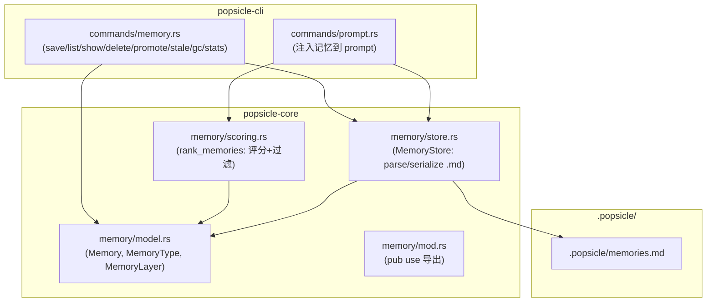

# Auto-Memory Implementation Plan

## 架构概览



## Phase 1 — Core: 数据模型与存储

### 1.1 数据模型 — `memory/model.rs`

新建 [crates/popsicle-core/src/memory/model.rs](crates/popsicle-core/src/memory/model.rs)

```rust
pub enum MemoryType { Bug, Decision, Pattern, Gotcha }
pub enum MemoryLayer { ShortTerm, LongTerm }

pub struct Memory {
    pub id: u32,
    pub memory_type: MemoryType,
    pub summary: String,
    pub created: String,          // "2026-03-14"
    pub layer: MemoryLayer,
    pub refs: u32,
    pub tags: Vec<String>,
    pub files: Vec<String>,
    pub run: Option<String>,
    pub stale: bool,
    pub detail: String,           // 1-5 行
}
```

- `id` 使用自增数字（简单，CLI 友好：`popsicle memory show 3`）
- `Display` / `FromStr` 为 `MemoryType` 和 `MemoryLayer` 实现序列化

### 1.2 Markdown 序列化/反序列化 — `memory/store.rs`

新建 [crates/popsicle-core/src/memory/store.rs](crates/popsicle-core/src/memory/store.rs)

核心职责：将 `Vec<Memory>` 与 `.popsicle/memories.md` 文件双向转换。

- `MemoryStore::load(path) -> Result<Vec<Memory>>` — 解析 Markdown 为 Memory 列表
- `MemoryStore::save(path, memories) -> Result<()>` — 序列化 Memory 列表为 Markdown
- `MemoryStore::line_count(memories) -> usize` — 计算序列化后行数
- 常量 `MAX_LINES: usize = 200`

**解析策略**：按 `### [TYPE] summary` 切分 H3 块，用正则提取元数据行（`**Created**:`、`**Tags**:` 等），剩余行为 detail。

**序列化格式**：按 RFC 定义的 Markdown 结构输出，Long-term 在前、Short-term 在后，中间用 `---` 分隔。

### 1.3 记忆评分与过滤 — `memory/scoring.rs`

新建 [crates/popsicle-core/src/memory/scoring.rs](crates/popsicle-core/src/memory/scoring.rs)

```rust
pub fn rank_memories(
    memories: &[Memory],
    current_skill: Option<&str>,
    changed_files: &[String],
    limit: usize,
) -> Vec<&Memory>
```

评分公式：`score = type_weight × match_score`

- `type_weight`：Pattern=1.0, Bug=0.8, Decision=0.6, Gotcha=0.5
- `match_score`：tags 交集数 + files 交集数（简单计数，无需 embedding）
- stale 记忆降权 50%
- 返回 top-N（默认 10）

注意：`recency_weight` 需要知道"当前是第几个 pipeline run"，初期简化为不按 run 衰减，仅按 layer 区分（long-term 权重略高于 short-term）。

### 1.4 模块注册 — `memory/mod.rs` + `lib.rs`

- 新建 [crates/popsicle-core/src/memory/mod.rs](crates/popsicle-core/src/memory/mod.rs)，导出 `Memory`、`MemoryType`、`MemoryLayer`、`MemoryStore`、`rank_memories`
- 在 [crates/popsicle-core/src/lib.rs](crates/popsicle-core/src/lib.rs) 中添加 `pub mod memory;`

### 1.5 ProjectLayout 扩展

在 [crates/popsicle-core/src/storage/mod.rs](crates/popsicle-core/src/storage/mod.rs) 的 `ProjectLayout` 中添加：

```rust
pub fn memories_path(&self) -> PathBuf {
    self.root.join("memories.md")
}
```

## Phase 2 — CLI: `popsicle memory` 命令族

### 2.1 命令模块 — `commands/memory.rs`

新建 [crates/popsicle-cli/src/commands/memory.rs](crates/popsicle-cli/src/commands/memory.rs)

遵循 `context.rs` 的 Subcommand 模式：

```rust
#[derive(clap::Subcommand)]
pub enum MemoryCommand {
    Save(SaveArgs),
    List(ListArgs),
    Show(ShowArgs),
    Delete(DeleteArgs),
    Promote(PromoteArgs),
    Stale(StaleArgs),
    Gc,
    Stats,
}
```

**各子命令实现要点**：

- **save**: 解析 `--type/--summary/--detail/--tags/--files/--run`，构建 `Memory`，分配 `id = max_id + 1`，检查 200 行上限，追加到 memories 列表，调用 `MemoryStore::save`
- **list**: 加载全部记忆，按 `--layer/--type` 过滤，text 模式下表格输出 id/type/layer/summary，json 模式下序列化全部字段
- **show**: 按 id 查找并输出完整信息（含 detail）
- **delete**: 按 id 删除，重写文件
- **promote**: 将指定 id 的 layer 从 short-term 改为 long-term
- **stale**: 将指定 id 标记为 stale
- **gc**: 删除所有 stale=true 的记忆
- **stats**: 输出总行数/200、各 type 计数、各 layer 计数、stale 数

### 2.2 命令注册

在 [crates/popsicle-cli/src/commands/mod.rs](crates/popsicle-cli/src/commands/mod.rs) 中：

- 添加 `mod memory;`
- 在 `Command` 枚举中添加 `#[command(subcommand)] Memory(memory::MemoryCommand)`
- 在 `execute` 的 match 中添加 `Command::Memory(sub) => memory::execute(sub, format)`

## Phase 3 — Prompt 注入集成

### 3.1 修改 `prompt.rs` 的 `build_full_prompt`

在 [crates/popsicle-cli/src/commands/prompt.rs](crates/popsicle-cli/src/commands/prompt.rs) 中：

- 新增 `load_memories()` 函数：加载 `.popsicle/memories.md`，调用 `rank_memories` 获取 top-10
- 修改 `build_full_prompt` 签名增加 `memories: &Option<Vec<Memory>>` 参数
- 注入位置：在 project context 之后、input context 之前（最低 attention 区域）
- 注入格式：

```
## Project Memories

以下是项目积累的经验，请在工作中注意避免已知问题：
- [BUG] summary1
- [PATTERN] summary2
```

- JSON 输出增加 `"memories"` 字段

**关键决策**：记忆注入在 `prompt.rs` 层处理（而非修改 `assemble_input_context` 签名），与 `project_context` 的处理方式保持一致，避免侵入 core 的 context 组装逻辑。

## Phase 4 — 测试

- `memory/model.rs`: MemoryType/MemoryLayer 的 Display/FromStr 测试
- `memory/store.rs`: Markdown 解析（正常、边界、空文件）、序列化往返测试、200 行上限检查
- `memory/scoring.rs`: 评分排序、tags 匹配、stale 降权、limit 截断
- `commands/memory.rs`: save+list 的集成测试（创建临时目录）
- `commands/prompt.rs`: build_full_prompt 含 memories 的顺序测试
