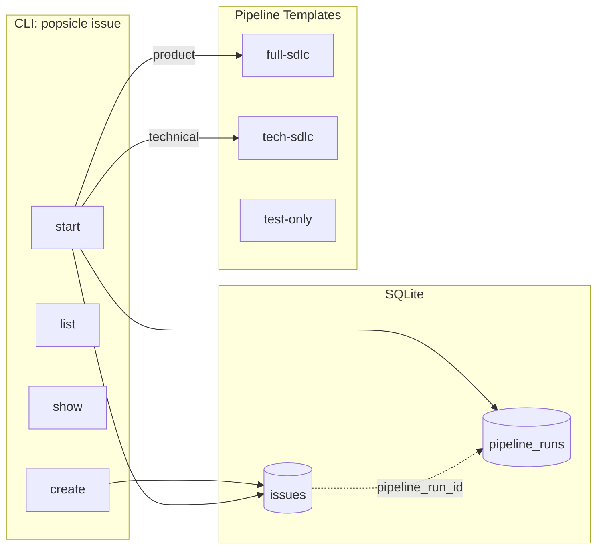

# Issue Tracking System

## 整体架构




## 1. 数据模型 — Issue

新建 `[crates/popsicle-core/src/model/issue.rs](crates/popsicle-core/src/model/issue.rs)`

```rust
pub struct Issue {
    pub id: String,              // UUID
    pub key: String,             // "PROJ-1" 自动递增
    pub title: String,
    pub description: String,
    pub issue_type: IssueType,
    pub priority: Priority,
    pub status: IssueStatus,
    pub pipeline_run_id: Option<String>,
    pub labels: Vec<String>,
    pub created_at: DateTime<Utc>,
    pub updated_at: DateTime<Utc>,
}

pub enum IssueType { Product, Technical, Bug, Idea }
pub enum Priority { Critical, High, Medium, Low }
pub enum IssueStatus { Backlog, Ready, InProgress, Done, Cancelled }
```

- `key` 自动生成：读取 `config.toml` 中的 `project.key_prefix`（默认 "PROJ"），数据库维护自增计数
- `pipeline_run_id`：执行 `issue start` 时关联

## 2. 存储层

在 `[crates/popsicle-core/src/storage/index.rs](crates/popsicle-core/src/storage/index.rs)` 中新增：

**SQLite 表**：

```sql
CREATE TABLE IF NOT EXISTS issues (
    id TEXT PRIMARY KEY,
    key TEXT NOT NULL UNIQUE,
    title TEXT NOT NULL,
    description TEXT NOT NULL DEFAULT '',
    issue_type TEXT NOT NULL,
    priority TEXT NOT NULL DEFAULT 'medium',
    status TEXT NOT NULL DEFAULT 'backlog',
    pipeline_run_id TEXT,
    labels TEXT NOT NULL DEFAULT '[]',
    created_at TEXT NOT NULL,
    updated_at TEXT NOT NULL
);
CREATE INDEX IF NOT EXISTS idx_issue_key ON issues(key);
CREATE INDEX IF NOT EXISTS idx_issue_status ON issues(status);
CREATE INDEX IF NOT EXISTS idx_issue_type ON issues(issue_type);
```

**方法**：

- `create_issue(issue) -> Result<Issue>` — 自动分配 key（查 MAX key 序号 + 1）
- `get_issue(id_or_key) -> Result<Option<Issue>>` — 支持按 id 或 key 查询
- `query_issues(type?, status?, label?) -> Result<Vec<Issue>>`
- `update_issue(issue) -> Result<()>`
- `next_issue_seq(prefix) -> Result<u32>` — 获取下一个序号

## 3. 新建 tech-sdlc Pipeline

新建 `[pipelines/tech-sdlc.pipeline.yaml](pipelines/tech-sdlc.pipeline.yaml)`：

```yaml
name: tech-sdlc
description: Technical requirement lifecycle — architecture debate through testing

stages:
  - name: arch-debate
    skill: arch-debate
    description: Multi-persona architecture debate for technical decisions

  - name: tech-design
    skills: [rfc, adr]
    description: Technical RFC and Architecture Decision Record
    depends_on: [arch-debate]

  - name: test-planning
    skills: [priority-test-gate, api-test-gen, functional-e2e]
    description: Test specification and generation
    depends_on: [tech-design]

  - name: quality
    skills: [bug-tracker, test-report]
    description: Bug tracking and test report analysis
    depends_on: [test-planning]
```

## 4. Issue 类型与 Pipeline 映射

在 Issue model 中定义映射逻辑：

- `Product` -> `full-sdlc`
- `Technical` -> `tech-sdlc`
- `Bug` -> `test-only`
- `Idea` -> 不自动关联 pipeline（仅记录）

## 5. CLI 命令

新建 `[crates/popsicle-cli/src/commands/issue.rs](crates/popsicle-cli/src/commands/issue.rs)`，在 `[commands/mod.rs](crates/popsicle-cli/src/commands/mod.rs)` 注册 `Issue(issue::IssueCommand)`。

子命令：

- `**popsicle issue create**`
  - `--type <product|technical|bug|idea>`
  - `--title "用户登录功能"`
  - `--description "..."` (可选)
  - `--priority <critical|high|medium|low>` (默认 medium)
  - `--label <label>` (可重复)
  - 返回自动生成的 key (如 `PROJ-1`)
- `**popsicle issue list**`
  - `--type <type>` / `--status <status>` / `--label <label>` 过滤
  - 输出表格或 JSON
- `**popsicle issue show <key>**`
  - 显示详情，包含关联的 pipeline run 状态
- `**popsicle issue start <key>**`
  - 根据 `issue_type` 选择 pipeline
  - 创建 `PipelineRun`，将 `pipeline_run_id` 写回 issue
  - 更新 issue status 为 `InProgress`
  - 输出 run id 和第一步建议
- `**popsicle issue update <key>**`
  - `--status <status>` / `--priority <priority>` / `--label <label>`

## 6. DTO 与 Tauri 集成

在 `[crates/popsicle-core/src/dto.rs](crates/popsicle-core/src/dto.rs)` 添加 `IssueInfo` 和 `IssueFull` DTO。

在 `[crates/popsicle-cli/src/ui/commands.rs](crates/popsicle-cli/src/ui/commands.rs)` 添加 Tauri 命令：

- `list_issues` / `get_issue` / `create_issue` / `start_issue` / `update_issue`

在 `[crates/popsicle-cli/src/ui/mod.rs](crates/popsicle-cli/src/ui/mod.rs)` 的 `invoke_handler` 中注册。

## 7. Agent 指令集成

在 `[crates/popsicle-core/src/agent/mod.rs](crates/popsicle-core/src/agent/mod.rs)` 的 `build_overview` 中追加 issue 命令说明，让 AI agent 知道如何使用：

```markdown
## Issue Tracking
- `popsicle issue list --format json` — 查看所有需求
- `popsicle issue show <key> --format json` — 查看需求详情
- `popsicle issue start <key>` — 启动需求对应的工作流

当用户说"开始 PROJ-1"或"启动需求 PROJ-1"时：
1. 执行 `popsicle issue start <key>`
2. 然后执行 `popsicle pipeline next --format json` 获取第一步
```

## 8. 项目配置

在 `config.toml` 中添加 issue 前缀配置（`popsicle init` 时生成）：

```toml
[project]
key_prefix = "PROJ"
```

## 实现顺序

按依赖关系从底层到上层实现，每步可独立编译测试。