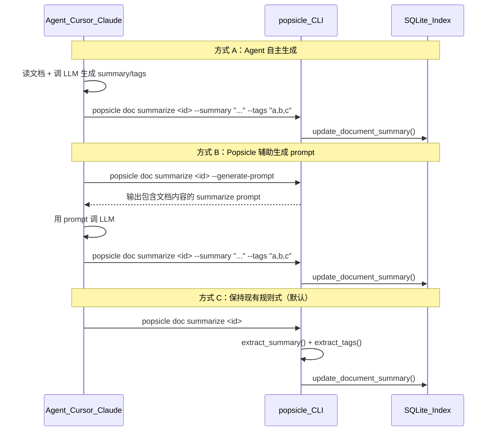

# 支持 LLM 生成 Summary 和 Tags（Agent 驱动模式）

## 设计思路

采用**依赖反转**：Popsicle 不直接调用 LLM，而是提供两个能力：

1. **写入接口**：Agent 调 LLM 后，用 `--summary` / `--tags` 参数直接写入索引
2. **Prompt 生成**：`--generate-prompt` 输出专用 summarize prompt，Agent 可用它调 LLM

交互流程：




## 具体改动

### 1. 扩展 `DocCommand::Summarize` 参数

文件：[crates/popsicle-cli/src/commands/doc.rs](crates/popsicle-cli/src/commands/doc.rs)

当前定义（第 55-61 行）：

```rust
Summarize {
    id: Option<String>,
    #[arg(short, long)]
    run: Option<String>,
}
```

扩展为：

```rust
Summarize {
    /// Document ID (if omitted, processes all unsummarized documents in the run)
    id: Option<String>,
    /// Pipeline run ID (used when no doc ID is given)
    #[arg(short, long)]
    run: Option<String>,
    /// Directly provide LLM-generated summary (skips rule-based extraction)
    #[arg(long)]
    summary: Option<String>,
    /// Directly provide LLM-generated tags (comma-separated, skips rule-based extraction)
    #[arg(long)]
    tags: Option<String>,
    /// Output a prompt for LLM-based summarization instead of generating summary
    #[arg(long, default_value_t = false)]
    generate_prompt: bool,
}
```

### 2. 实现三种模式分支

在 `summarize_doc` 函数中（同文件，约第 553 行），根据参数选择不同路径：

- `**--summary` / `--tags` 提供时**：直接写入索引，跳过规则提取。`--tags` 解析为逗号分隔列表。`id` 此时为必填（需验证）。
- `**--generate-prompt` 时**：读取文档内容，输出一个结构化的 summarize prompt 到 stdout（包含文档标题、类型、正文），Agent 拿去调 LLM。`id` 此时为必填。
- **默认（无上述参数）**：保持现有行为，调用 `extract_summary()` + `extract_tags()`。

### 3. Summarize Prompt 模板

`--generate-prompt` 输出的 prompt 格式（在 `doc.rs` 中实现，不需要新文件）：

```text
You are analyzing a technical document for indexing purposes.

Document metadata:
- Title: {title}
- Type: {doc_type}
- Skill: {skill_name}

Document content:
---
{body}
---

Please provide:
1. A concise summary (3-5 sentences) that captures the key decisions, requirements, or design choices in this document.
2. A list of semantic tags (5-15 keywords) that would help find this document when searching for related topics.

Respond in JSON format:
{"summary": "...", "tags": ["tag1", "tag2", ...]}
```

JSON 输出模式下，将 prompt 包装在 JSON 对象中：`{"doc_id": "...", "prompt": "..."}`。

### 4. 调用时机与 auto-summarize 策略

**时机：approve 之后立即**。完整流程：

```
1. Agent 调用 popsicle doc transition <id> approve --confirm
   → Popsicle 自动生成规则式 summary/tags（即时 fallback）
2. Agent 立即调用 popsicle doc summarize <id> --generate-prompt
   → 获取包含文档内容的 summarize prompt
3. Agent 用 prompt 调 LLM 生成高质量 summary/tags
4. Agent 调用 popsicle doc summarize <id> --summary "..." --tags "a,b,c"
   → LLM 结果覆盖规则式结果
```

`transition_doc` 中的规则式自动摘要保持不变（第 473-481 行），作为 fallback——即使 Agent 没有跟进 LLM 步骤，文档也有基础摘要可用于 FTS5 检索。

### 5. 更新 Agent 安装模板

文件：[crates/popsicle-core/src/agent/mod.rs](crates/popsicle-core/src/agent/mod.rs)

在 Agent 指导文件（CLAUDE.md / .cursor rules）的 **文档生命周期** 部分添加 summarize 指导：

```markdown
## 文档摘要生成（approve 后立即执行）

当你 approve 一个文档后，立即执行以下步骤为文档生成高质量摘要：

1. 获取 summarize prompt：
   popsicle doc summarize <doc-id> --generate-prompt --format json

2. 用返回的 prompt 调用 LLM 生成 summary 和 tags

3. 将结果写入索引：
   popsicle doc summarize <doc-id> --summary "摘要内容" --tags "tag1,tag2,tag3"
```

### 6. 更新 RFC

文件：[docs/rfc-document-index.md](docs/rfc-document-index.md)

在 "Interface Changes" 和 "Detailed Design > 2. 摘要/标签生成" 中补充 Agent 驱动模式的说明。