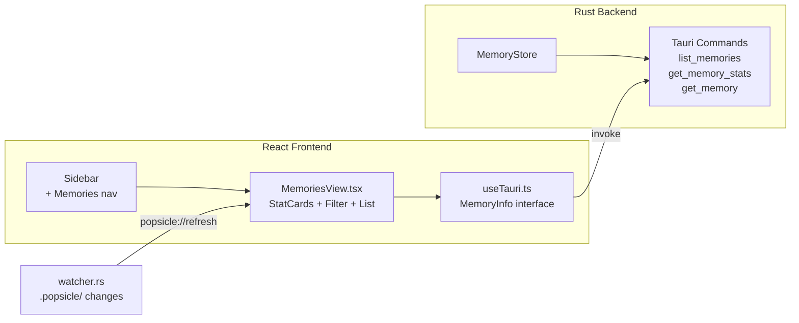

# Auto-Memory Phase 4/5 + UI 实现计划

## Phase 4 — Agent Skill 记忆触发指导

在 `popsicle init --agent` 生成的 Agent 指令文件中加入 Memory 使用指导，让 Cursor/Claude Code Agent 知道何时、如何调用 `popsicle memory save`。

### 4.1 扩展 `build_overview()` 添加 Memory 命令目录

在 [crates/popsicle-core/src/agent/mod.rs](crates/popsicle-core/src/agent/mod.rs) 的 `build_overview()` 函数中，在 "Workflow Rules" 之后追加：

```rust
s.push_str("\n## Memory Management\n\n");
s.push_str("- `popsicle memory save --type <bug|decision|pattern|gotcha> --summary \"...\" ...`\n");
s.push_str("- `popsicle memory list` / `popsicle memory stats`\n");
s.push_str("- `popsicle memory promote <id>` / `popsicle memory gc`\n");
s.push_str("\n### When to Save Memories\n\n");
// 4 条触发规则 + 3 条写入原则
```

### 4.2 新增 `popsicle-memory` Agent Skill

在同一文件中添加 `SKILL_MEMORY` 常量（类似现有 `SKILL_NEXT`），并在 `install_claude()` 和 `install_cursor()` 中注册。

Skill 内容：引导 Agent 在修复 bug、做出技术决策、发现反模式、踩坑后自动调用 `popsicle memory save`，并给出 CLI 模板。

---

## Phase 5 — 生命周期自动化

### 5.1 短期遗忘

在 [crates/popsicle-core/src/memory/store.rs](crates/popsicle-core/src/memory/store.rs) 中新增 `MemoryStore::expire_short_term()` 方法：

- 删除 `layer == ShortTerm && refs == 0 && created 早于 N 天`（默认 30 天）的记忆
- 返回被删除的条目数

在 `prompt.rs` 的 `load_ranked_memories()` 中自动调用，静默清理。

### 5.2 Stale 检测

新增 `check-stale` 子命令到 [crates/popsicle-cli/src/commands/memory.rs](crates/popsicle-cli/src/commands/memory.rs)：

```rust
MemoryCommand::CheckStale => execute_check_stale(format)
```

实现逻辑：

- 遍历 long-term 记忆中有 `files` 的条目
- 用 `git log --since=<created> --stat -- <file>` 检测关联文件变更
- 变更行数 > 阈值（50 行）则标记 `stale = true`
- 依赖已有的 [crates/popsicle-core/src/git/tracker.rs](crates/popsicle-core/src/git/tracker.rs)，新增一个 `GitTracker::file_change_since()` 方法

### 5.3 容量告警

在 `memory.rs` 的 `execute_save()` 中，保存成功后若 `line_count > MAX_LINES * 80%` 则输出警告。
在 `prompt.rs` 的 `load_ranked_memories()` 中也做同样检查，向 stderr 输出警告。

---

## UI — Memories 页面

遵循现有 UI 架构模式（"CLI Executes, UI Observes" 原则，只读展示）。

### 后端 Tauri Commands

在 [crates/popsicle-core/src/dto.rs](crates/popsicle-core/src/dto.rs) 添加：

```rust
pub struct MemoryInfo {
    pub id: u32, pub memory_type: String, pub summary: String,
    pub created: String, pub layer: String, pub refs: u32,
    pub tags: Vec<String>, pub files: Vec<String>,
    pub run: Option<String>, pub stale: bool, pub detail: String,
}

pub struct MemoryStatsInfo {
    pub line_count: usize, pub max_lines: usize, pub total: usize,
    pub long_term: usize, pub short_term: usize,
    pub bugs: usize, pub decisions: usize, pub patterns: usize, pub gotchas: usize,
    pub stale: usize,
}
```

在 [crates/popsicle-cli/src/ui/commands.rs](crates/popsicle-cli/src/ui/commands.rs) 添加 3 个 Tauri 命令：

- `list_memories(layer?, memory_type?)` -> `Vec<MemoryInfo>`
- `get_memory_stats()` -> `MemoryStatsInfo`
- `get_memory(id)` -> `MemoryInfo`

在 [crates/popsicle-cli/src/ui/mod.rs](crates/popsicle-cli/src/ui/mod.rs) 的 `invoke_handler` 注册这 3 个命令。

### 前端页面

在 [ui/src/hooks/useTauri.ts](ui/src/hooks/useTauri.ts) 添加 TypeScript 接口和调用函数。

创建 [ui/src/pages/MemoriesView.tsx](ui/src/pages/MemoriesView.tsx)：

- 顶部 4 个 `StatCard`：总记忆数、长期/短期比例、容量使用（`line_count/200`）、stale 数
- 容量进度条（绿/黄/红根据百分比）
- 筛选栏：按 layer（全部/长期/短期）和 type（全部/Bug/Decision/Pattern/Gotcha）过滤
- 记忆列表：`divide-y` 列表，每行显示 type badge + summary + tags + layer + refs + stale 标记
- 点击展开详情（detail 文本 + files + run）

在 [ui/src/components/Sidebar.tsx](ui/src/components/Sidebar.tsx) 添加 "Memories" 导航项（使用 `Brain` 图标）。

在 [ui/src/App.tsx](ui/src/App.tsx) 添加 `memories` page kind 和路由渲染。




