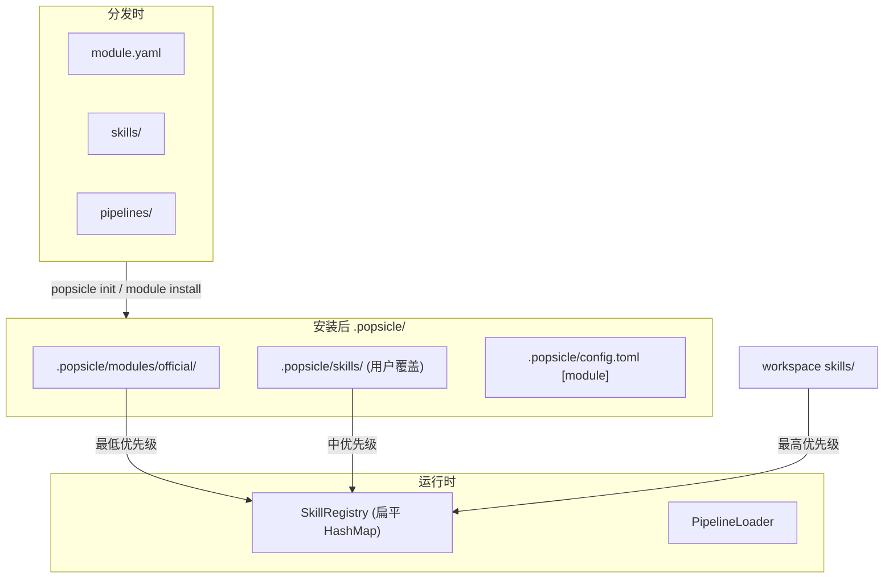

# Module as Self-Contained Distribution — 实现计划

## 架构概览




加载优先级（后加载覆盖先加载）:

1. `.popsicle/modules/<active>/skills/` — Module 提供（最低）
2. `.popsicle/skills/` — 用户自定义覆盖
3. `workspace skills/` — 开发中（最高）

## 1. 更新设计文档

**文件**: [docs/design-philosophy.md](docs/design-philosophy.md)

将 Section 9 的"未定决策"部分替换为最终决策——**策略 B：单活跃 Module**，并补充理由：

- Pipeline 只引用本 Module 内的 Skill，跨 Module 组合不存在
- Skill 级别的定制通过 `.popsicle/skills/` 覆盖机制已解决
- 多 Module 共存是包管理器级别的复杂度，不是 Popsicle 应承担的
- 如需组合能力，正确做法是创建包含两套 Skill 的新 Module

## 2. 添加 ModuleDef 模型

**新建**: `crates/popsicle-core/src/model/module.rs`

```rust
#[derive(Debug, Clone, Serialize, Deserialize)]
pub struct ModuleDef {
    pub name: String,
    pub version: String,
    pub description: Option<String>,
    pub author: Option<String>,
}
```

**修改**: [crates/popsicle-core/src/model/mod.rs](crates/popsicle-core/src/model/mod.rs) — 添加 `pub mod module;` 和 re-export

## 3. 创建顶层 module.yaml

**新建**: `module.yaml`（项目根目录，与 `skills/`、`pipelines/` 同级）

```yaml
name: official
version: "0.1.0"
description: "Popsicle official skill & pipeline collection"
```

这让项目根目录本身就是一个合法的 Module 分发包。

## 4. 修改 build.rs — 嵌入路径前缀调整

**文件**: [crates/popsicle-core/build.rs](crates/popsicle-core/build.rs)

将嵌入路径前缀从 `.popsicle/skills` → `.popsicle/modules/official/skills`，`.popsicle/pipelines` → `.popsicle/modules/official/pipelines`。同时额外嵌入根目录的 `module.yaml` 到 `.popsicle/modules/official/module.yaml`。

关键改动（第 22-31 行）:

```rust
// 之前
collect_files(..., ".popsicle/skills", ...);
collect_files(..., ".popsicle/pipelines", ...);

// 之后
collect_files(..., ".popsicle/modules/official/skills", ...);
collect_files(..., ".popsicle/modules/official/pipelines", ...);
// 额外嵌入 module.yaml
entries.push((".popsicle/modules/official/module.yaml".into(), module_yaml_path));
```

## 5. 更新 ProjectLayout

**文件**: [crates/popsicle-core/src/storage/mod.rs](crates/popsicle-core/src/storage/mod.rs)（第 14-80 行）

新增方法：

```rust
pub fn modules_dir(&self) -> PathBuf {
    self.root.join("modules")
}

pub fn active_module_dir(&self, name: &str) -> PathBuf {
    self.modules_dir().join(name)
}
```

`initialize()` 方法不需要改动——`modules/official/` 目录在 `install_builtins()` 的 `create_dir_all` 中自动创建。

## 6. 更新 helpers.rs — 三层加载

**文件**: [crates/popsicle-core/src/helpers.rs](crates/popsicle-core/src/helpers.rs)

`load_registry()`（第 9-23 行）改为三层加载，**注意加载顺序是低优先级先加载**（HashMap insert 语义：后写覆盖先写）：

```rust
pub fn load_registry(project_dir: &Path) -> Result<SkillRegistry> {
    let mut registry = SkillRegistry::new();

    // 1. 活跃 Module（最低优先级，先加载）
    let config = load_config(project_dir);
    let module_name = config.module.name_or_default(); // "official"
    let module_skills = project_dir.join(".popsicle/modules").join(&module_name).join("skills");
    if module_skills.is_dir() {
        SkillLoader::load_dir(&module_skills, &mut registry)?;
    }

    // 2. 项目本地覆盖
    let local_skills = project_dir.join(".popsicle/skills");
    if local_skills.is_dir() {
        SkillLoader::load_dir(&local_skills, &mut registry)?;
    }

    // 3. workspace（最高优先级）
    let workspace_skills = project_dir.join("skills");
    if workspace_skills.is_dir() {
        SkillLoader::load_dir(&workspace_skills, &mut registry)?;
    }

    Ok(registry)
}
```

`load_pipelines()`（第 26-37 行）同样改为三层。

## 7. 扩展 config.toml

**文件**: [crates/popsicle-core/src/storage/config.rs](crates/popsicle-core/src/storage/config.rs)

新增 `ModuleSection`：

```rust
#[derive(Debug, Clone, Default, Serialize, Deserialize)]
pub struct ModuleSection {
    pub name: Option<String>,
    pub source: Option<String>,
    pub version: Option<String>,
}

impl ModuleSection {
    pub fn name_or_default(&self) -> &str {
        self.name.as_deref().unwrap_or("official")
    }
}
```

`ProjectConfig` 添加字段：

```rust
pub struct ProjectConfig {
    // ...existing fields...
    #[serde(default)]
    pub module: ModuleSection,
}
```

## 8. 更新 init.rs — 生成 config 时写入 [module]

**文件**: [crates/popsicle-cli/src/commands/init.rs](crates/popsicle-cli/src/commands/init.rs)

`default_config` 模板（约第 74-85 行）追加：

```toml
[module]
name = "official"
source = "builtin"
version = "0.1.0"
```

`init` 中加载 skills 的逻辑（约第 117-125 行）也需要改为从 `modules/official/skills/` 加载。

## 9. 新增 `popsicle module` CLI 命令

**新建**: `crates/popsicle-cli/src/commands/module.rs`

子命令：

- `**module list`** — 扫描 `.popsicle/modules/` 列出所有已安装 Module，标记当前活跃
- `**module show <name>`** — 显示 Module 详情（包含的 Skill 列表、Pipeline 列表、来源、版本）
- `**module install <source>`** — 安装新 Module，**替换**当前活跃 Module（保留 `.popsicle/skills/` 用户自定义）
  - 支持本地路径：`popsicle module install /path/to/module`
  - 支持 GitHub 短链：`popsicle module install github:user/repo`
  - 流程：拉取/复制 → 验证 `module.yaml` → 复制到 `.popsicle/modules/<name>/` → 更新 `config.toml` 中 `[module]`

**修改**: [crates/popsicle-cli/src/commands/mod.rs](crates/popsicle-cli/src/commands/mod.rs) — 添加 `Module(module::ModuleCommand)` 到 Command 枚举

## 10. 向后兼容 & 迁移

现有项目的 `.popsicle/skills/` 和 `.popsicle/pipelines/` 已有内置 skill/pipeline 文件。重新运行 `popsicle init` 时：

- `install_builtins()` 会写入到新路径 `.popsicle/modules/official/skills/`
- 旧路径 `.popsicle/skills/` 下的**内置 skill** 仍在，但因加载优先级更高会覆盖 Module 中的同名 skill，语义正确
- 不做自动迁移——用户下次 `init` 时新文件自然写入新路径

