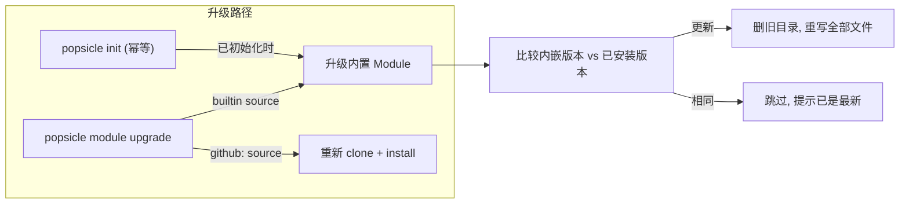

# Module 升级支持

## 问题

当 Popsicle 二进制升级后，内嵌的 official module 可能更新了 skill/pipeline，但：

- `popsicle init` 对已初始化的项目报 `AlreadyInitialized` 错误
- `install_builtins()` 跳过已存在文件，不覆盖
- 远程安装的 module 没有"重新拉取最新版"的入口

## 改动概览




## 1. scaffold.rs -- 增加内嵌版本查询和强制覆写

**文件**: [crates/popsicle-core/src/scaffold.rs](crates/popsicle-core/src/scaffold.rs)

新增两个函数：

- `embedded_module_version()` -- 从 `BUILTIN_FILES` 中找到 `module.yaml`，用 `serde_yaml_ng` 解析出版本
- `upgrade_builtins(project_root)` -- 删除 `.popsicle/modules/official/` 目录后重新写入全部内嵌文件，返回 `(old_version, new_version)`

```rust
pub fn embedded_module_version() -> Option<String> {
    BUILTIN_FILES.iter()
        .find(|f| f.path.ends_with("module.yaml"))
        .and_then(|f| {
            let def: ModuleDef = serde_yaml_ng::from_str(f.content).ok()?;
            Some(def.version)
        })
}

pub fn upgrade_builtins(project_root: &Path) -> Result<UpgradeResult> {
    // 1. 读取已安装版本
    // 2. 读取内嵌版本
    // 3. 删除 .popsicle/modules/official/ 目录
    // 4. 重新写入全部 BUILTIN_FILES（无条件写入）
    // 5. 返回 UpgradeResult { old_version, new_version, files_count }
}
```

关键区别：`install_builtins` 跳过已存在文件；`upgrade_builtins` 删除目录后全部重写。

## 2. init 改为可重入（幂等）

**文件**: [crates/popsicle-core/src/storage/mod.rs](crates/popsicle-core/src/storage/mod.rs) 第 78-88 行

`initialize()` 改为：已初始化时静默成功（`create_dir_all` 天然幂等），而非报错。返回值标示是否为首次初始化。

```rust
pub fn initialize(&self) -> Result<bool> {
    let first_time = !self.is_initialized();
    std::fs::create_dir_all(self.artifacts_dir())?;
    std::fs::create_dir_all(self.skills_dir())?;
    Ok(first_time)
}
```

**文件**: [crates/popsicle-cli/src/commands/init.rs](crates/popsicle-cli/src/commands/init.rs) 第 33-188 行

`execute()` 改为：

- 首次初始化走完整流程（当前逻辑）
- 重入时：跳过 config 生成（已存在），调用 `upgrade_builtins` 而非 `install_builtins`，重新生成 agent 指令文件，更新 `config.toml` 中的 module 版本

输出需区分两种场景：

- 首次: `Initialized Popsicle project at ...`
- 重入: `Upgraded Popsicle project at ...` + 显示版本变化

## 3. module CLI 增加 upgrade 子命令

**文件**: [crates/popsicle-cli/src/commands/module.rs](crates/popsicle-cli/src/commands/module.rs)

新增 `Upgrade` 子命令：

```rust
/// Upgrade the active module to the latest version
Upgrade {
    /// Force upgrade even if versions match
    #[arg(long)]
    force: bool,
},
```

逻辑：

- 读取 `config.toml` 中 `[module]` 的 source
- 如果 source 是 `"builtin"` -- 调用 `scaffold::upgrade_builtins()`
- 如果 source 是 `"github:..."` -- 重新走 `resolve_source` + `install_module` 流程（已有代码）
- `--force` 跳过版本比较

## 4. 清理 AlreadyInitialized 错误变体

**文件**: [crates/popsicle-core/src/error.rs](crates/popsicle-core/src/error.rs)

`AlreadyInitialized` 变体不再被使用，删除它。在 `initialize()` 返回 `bool` 后，调用方通过返回值判断是否首次初始化。