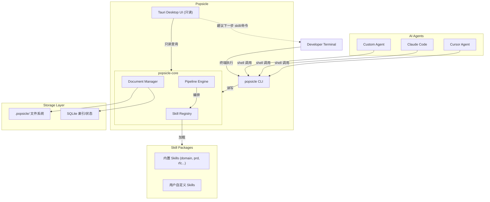
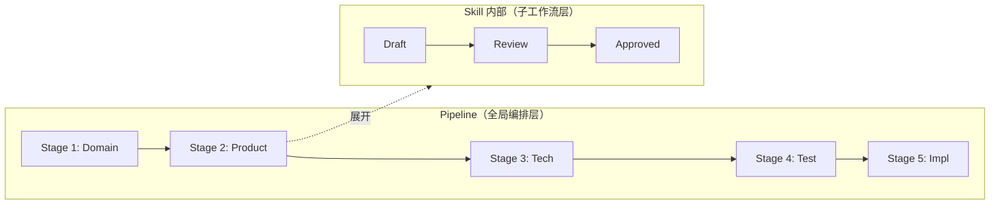
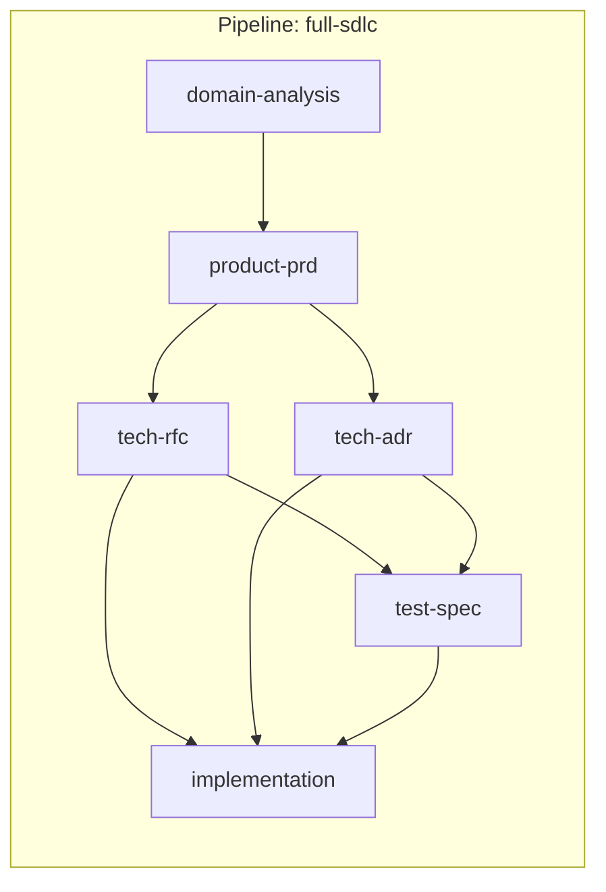

# Popsicle: Spec-Driven 开发编程助手

## 项目定位

Popsicle 是一只"监督 AI 编程的边牧"——一个 **Skill 编排引擎**，帮助开发者：

- 将软件开发生命周期拆解为可复用的 **Skill**（每个 Skill 自带局部工作流）
- 通过 **Pipeline** 将 Skills 编排为完整的开发流程（Domain 分析 → PRD → RFC/ADR → TestSpec → 实现）
- 通过 CLI 让 AI Agent 按流程逐步推进
- 通过桌面 UI **只读可视化** Pipeline 进度，并**建议下一步 Skill 或命令**

### 核心设计原则

- **Skill 是一等公民**：每个 Skill 自带子工作流、文档模板、输入输出定义
- **Pipeline 编排 Skills**：Popsicle 将 Skills 组合成端到端流程，管理阶段推进
- **CLI 是唯一的执行入口**：AI Agent 和开发者都通过 CLI 操作
- **UI 是只读的观察面板**：可视化 + 建议下一步，不执行写操作
- **可扩展优先**：文档类型、Skill、Pipeline 模板均可由用户自定义扩展

---

## 整体架构



**双层编排架构**：



- **Pipeline 层**：定义 Skills 的执行顺序和依赖关系
- **Skill 层**：每个 Skill 内部有自己的子工作流（如 Draft → Review → Approved）
- 实线箭头 = 读写操作（仅 CLI 路径）
- 虚线箭头 = 建议/提示（UI 建议命令，用户在终端执行）

## Rust Workspace 结构

```
popsicle/
├── Cargo.toml                  # workspace root
├── crates/
│   ├── popsicle-core/          # 核心库
│   │   ├── Cargo.toml
│   │   └── src/
│   │       ├── lib.rs
│   │       ├── model/          # 数据模型
│   │       │   ├── mod.rs
│   │       │   ├── document.rs # 通用文档模型（YAML frontmatter + Markdown）
│   │       │   ├── skill.rs    # Skill 定义模型
│   │       │   ├── pipeline.rs # Pipeline 定义模型
│   │       │   └── artifact.rs # Skill 产出物模型
│   │       ├── registry/       # Skill 注册与发现
│   │       │   ├── mod.rs
│   │       │   └── loader.rs   # 从文件系统加载 Skill 定义
│   │       ├── engine/         # 编排引擎
│   │       │   ├── mod.rs
│   │       │   ├── pipeline.rs # Pipeline 执行器（全局编排）
│   │       │   ├── workflow.rs # Skill 内部状态机
│   │       │   └── advisor.rs  # Next Step 建议生成器
│   │       ├── storage/        # 混合存储
│   │       │   ├── mod.rs
│   │       │   ├── file.rs     # 文件系统读写
│   │       │   └── index.rs    # SQLite 索引
│   │       └── error.rs
│   ├── popsicle-cli/           # CLI 二进制
│   │   ├── Cargo.toml
│   │   └── src/
│   │       ├── main.rs
│   │       └── commands/
│   │           ├── mod.rs
│   │           ├── init.rs
│   │           ├── skill.rs    # skill list/run/status
│   │           ├── pipeline.rs # pipeline create/status/next
│   │           ├── doc.rs      # doc create/list/show/update
│   │           └── context.rs  # context 输出（AI Agent 用）
│   └── popsicle-tauri/         # Tauri 桌面应用
│       ├── Cargo.toml
│       ├── src/main.rs
│       └── tauri.conf.json
├── ui/                          # 前端（React + TypeScript）
│   ├── package.json
│   └── src/
├── skills/                      # 内置 Skill 包
│   ├── domain-analysis/         # Domain 边界分析
│   │   └── skill.yaml
│   ├── product-prd/             # PRD 产出
│   │   └── skill.yaml
│   ├── tech-rfc/                # 技术 RFC
│   │   └── skill.yaml
│   ├── tech-adr/                # 架构决策记录
│   │   └── skill.yaml
│   ├── test-spec/               # 测试 Spec
│   │   └── skill.yaml
│   └── implementation/          # 代码实现
│       └── skill.yaml
├── pipelines/                   # 内置 Pipeline 模板
│   └── full-sdlc.pipeline.yaml # 完整开发生命周期
└── docs/
```

---

## 核心模块设计

### 1. Skill 模型（核心抽象）

Skill 是 Popsicle 的一等公民——**一个自带局部工作流的可复用开发能力单元**。

**Skill 定义格式** (`skills/product-prd/skill.yaml`):

```yaml
name: product-prd
description: 产品需求文档(PRD)生成与管理
version: "0.1.0"

# Skill 的输入：依赖哪些其他 Skill 的产出物
inputs:
  - from_skill: domain-analysis
    artifact_type: domain-model
    required: true

# Skill 的产出物：该 Skill 生成什么类型的文档
artifacts:
  - type: prd
    template: templates/prd.md        # 文档模板路径（相对 skill 目录）
    file_pattern: "{slug}.prd.md"     # 产出文件的命名规则

# Skill 内部的子工作流
workflow:
  initial: draft
  states:
    draft:
      transitions:
        - to: discussion
          action: submit
    discussion:
      transitions:
        - to: approved
          action: approve
        - to: draft
          action: revise
    approved:
      final: true

# Skill 关联的 AI 提示/指令（供 AI Agent 在各阶段使用）
prompts:
  draft: |
    根据以下 Domain Model 编写 PRD 草稿...
  discussion: |
    审查以下 PRD，检查是否遗漏需求...

# 扩展点：Skill 可以声明自己的 hooks
hooks:
  on_enter: null          # 进入此 Skill 时触发
  on_artifact_created: null  # 产出物创建时触发
  on_complete: null       # Skill 完成时触发
```

**核心 Rust 数据结构**:

```rust
// model/skill.rs
pub struct SkillDef {
    pub name: String,
    pub description: String,
    pub version: String,
    pub inputs: Vec<SkillInput>,
    pub artifacts: Vec<ArtifactDef>,
    pub workflow: WorkflowDef,
    pub prompts: HashMap<String, String>,
    pub hooks: HooksDef,
    pub source_path: PathBuf,       // skill.yaml 所在目录
}

pub struct SkillInput {
    pub from_skill: String,          // 来源 Skill 名称
    pub artifact_type: String,       // 所需产出物类型
    pub required: bool,
}

pub struct ArtifactDef {
    pub artifact_type: String,       // 如 "prd", "rfc", "adr", "test-spec"
    pub template: PathBuf,
    pub file_pattern: String,
}

// model/document.rs — 通用文档模型
pub struct Document {
    pub id: String,
    pub doc_type: String,            // 对应 artifact_type，可扩展
    pub title: String,
    pub status: String,              // 由所属 Skill 的 workflow 定义
    pub skill_name: String,          // 由哪个 Skill 产出
    pub pipeline_run_id: String,     // 属于哪次 Pipeline 运行
    pub metadata: serde_yaml::Value, // 自由扩展的元数据
    pub body: String,                // Markdown 正文
    pub file_path: PathBuf,
}
```

### 2. Pipeline 模型（全局编排）

Pipeline 定义了 Skills 的执行顺序和依赖关系：

**Pipeline 定义格式** (`pipelines/full-sdlc.pipeline.yaml`):

```yaml
name: full-sdlc
description: 完整的软件开发生命周期

stages:
  - name: domain
    skill: domain-analysis
    description: Domain 边界分析与模型定义

  - name: product
    skill: product-prd
    description: 产品需求文档编写
    depends_on: [domain]

  - name: tech-design
    skills:                            # 一个 stage 可包含多个并行 Skills
      - tech-rfc
      - tech-adr
    description: 技术方案设计
    depends_on: [product]

  - name: test-design
    skill: test-spec
    description: 测试规格设计
    depends_on: [tech-design]

  - name: implementation
    skill: implementation
    description: 代码实现
    depends_on: [tech-design, test-design]
```



**核心 Rust 数据结构**:

```rust
// model/pipeline.rs
pub struct PipelineDef {
    pub name: String,
    pub description: String,
    pub stages: Vec<StageDef>,
}

pub struct StageDef {
    pub name: String,
    pub skills: Vec<String>,         // 一个或多个 Skill
    pub description: String,
    pub depends_on: Vec<String>,     // 依赖的 stage 名称
}

// Pipeline 的运行实例
pub struct PipelineRun {
    pub id: String,
    pub pipeline_name: String,
    pub title: String,               // 如 "用户认证系统"
    pub stage_states: HashMap<String, StageState>,
    pub created_at: DateTime,
}

pub enum StageState {
    Blocked,        // 前置依赖未完成
    Ready,          // 可以开始
    InProgress,     // 正在进行（Skill 子工作流进行中）
    Completed,      // 已完成
    Skipped,        // 被跳过
}
```

### 3. 编排引擎（popsicle-core/engine）

**双层编排**：

- **Pipeline Engine**：管理 Stage 之间的推进，检查依赖是否满足
- **Workflow Engine**：管理每个 Skill 内部的状态流转

```rust
// engine/advisor.rs — Next Step 建议生成器
pub struct NextStep {
    pub stage: String,               // 当前所处 Stage
    pub skill: String,               // 推荐的 Skill
    pub action: String,              // 推荐的 action（如 "submit", "approve"）
    pub cli_command: String,          // 可直接复制执行的 CLI 命令
    pub prompt: Option<String>,      // 推荐给 AI Agent 的 prompt
    pub blocked_by: Vec<String>,     // 如果被阻塞，列出阻塞原因
}
```

### 4. 存储层（popsicle-core/storage）

混合存储策略：

- **文件系统**: 所有文档存为 `{type}.md` 文件，便于 Git 版本控制和 AI Agent 直接读取
- **SQLite**: 存储 Pipeline 运行状态、文档索引、Skill 注册表

```
.popsicle/                          # 项目根目录下
├── popsicle.db                     # SQLite（索引、状态、注册表）
├── config.toml                     # 项目配置
├── artifacts/                      # 按 Pipeline Run 组织的产出物
│   └── user-auth/                  # Pipeline Run: 用户认证系统
│       ├── domain-model.md         # domain-analysis Skill 产出
│       ├── user-auth.prd.md        # product-prd Skill 产出
│       ├── auth-jwt.rfc.md         # tech-rfc Skill 产出
│       ├── auth-strategy.adr.md    # tech-adr Skill 产出
│       └── auth.test-spec.md       # test-spec Skill 产出
└── skills/                         # 项目级自定义 Skills（可选）
    └── my-custom-skill/
        └── skill.yaml
```

### 5. CLI 设计（popsicle-cli）

使用 `clap` 构建，所有命令支持 `--format json` 供 AI Agent 消费：

```
# 项目初始化
popsicle init                                    # 初始化 .popsicle/
popsicle init --pipeline full-sdlc               # 初始化并选择 Pipeline 模板

# Skill 管理
popsicle skill list                              # 列出所有已注册 Skills
popsicle skill show <name>                       # 查看 Skill 详情（含子工作流）
popsicle skill create <name>                     # 创建自定义 Skill 骨架

# Pipeline 管理
popsicle pipeline list                           # 列出可用 Pipeline 模板
popsicle pipeline run <pipeline> --title <t>     # 开始一次 Pipeline 运行
popsicle pipeline status [run-id]                # 查看 Pipeline 运行状态
popsicle pipeline next [run-id]                  # 查看下一步建议

# 文档（产出物）管理
popsicle doc create <skill> [--run <run-id>]     # 用 Skill 模板创建文档
popsicle doc list [--skill <s>] [--status <s>]   # 列出文档
popsicle doc show <doc-id>                       # 查看文档内容
popsicle doc transition <doc-id> <action>        # 推进文档状态（按 Skill 子工作流）

# AI Agent 上下文
popsicle context [run-id]                        # 输出当前 Pipeline 运行的完整上下文
popsicle context --stage <stage>                 # 输出特定阶段的上下文
popsicle prompt <skill> [--state <s>]            # 获取 Skill 在特定状态下的 AI prompt
```

**AI Agent 交互示例**:

```bash
# 1. 开始一个新的开发流程
$ popsicle pipeline run full-sdlc --title "用户认证系统" --format json

# 2. 查看下一步该做什么
$ popsicle pipeline next --format json
# 输出: { "stage": "domain", "skill": "domain-analysis", "action": "draft",
#         "cli_command": "popsicle doc create domain-analysis --run run-001",
#         "prompt": "分析以下系统的 Domain 边界..." }

# 3. 获取 AI prompt 让 Agent 执行
$ popsicle prompt domain-analysis --state draft

# 4. Agent 创建文档后推进状态
$ popsicle doc transition doc-001 submit

# 5. 获取当前完整上下文（包含所有已产出文档）
$ popsicle context run-001 --format json
```

### 6. Tauri 桌面 UI（popsicle-tauri + ui/）— 只读可视化 + 引导

前端使用 React + TypeScript + TailwindCSS。**UI 不执行任何写操作**，所有 Tauri Command 均为只读查询。

**核心理念**：UI 是"控制塔"——看全局、给建议、不动手。

UI 覆盖三大可视化维度：**元数据结构化展示**、**文档内容渲染**、**Skill 全生命周期产出物浏览**。

---

#### 6.1 Dashboard — 全局概览

- Pipeline Run 列表：所有进行中/已完成的 Pipeline 运行
- 当前选中 Run 的 Stage 进度条（各 Stage 的完成百分比）
- 统计卡片：文档总数、各状态分布、各 Skill 产出数量
- 最近活动时间线：按时间顺序展示文档创建/状态流转事件

#### 6.2 Pipeline 可视化 — DAG 全景图

- 以 DAG（有向无环图）展示 Pipeline 中各 Stage 和 Skill 的依赖关系
- 每个节点显示 Stage 名称 + 当前状态（Blocked/Ready/InProgress/Completed）
- 点击节点可展开查看该 Stage 下所有 Skill 产出的文档列表
- 高亮当前活跃的 Stage 和可执行的下一步

#### 6.3 元数据面板 — 结构化数据可视化

选中任意文档后，右侧/底部展示结构化元数据面板：

- **核心属性卡片**：id、doc_type、status（带颜色徽标）、所属 Skill、所属 Pipeline Run
- **关联关系图**：
  - 上游：该文档依赖的输入文档（来自哪个 Skill 的产出）
  - 下游：哪些文档依赖了本文档（作为输入的后续 Skill）
  - 以小型关系图展示文档间的数据流
- **状态流转时间线**：该文档经历的所有状态变迁（draft → discussion → approved），附时间戳
- **自定义元数据**：Skill 定义的扩展字段（如 PRD 的优先级、RFC 的决策结果）以 key-value 表格展示
- **文件信息**：文件路径、创建时间、最后修改时间、Git 版本（如有）

#### 6.4 文档内容查看器 — Markdown 渲染

- 富文本 Markdown 渲染（标题层级、代码块高亮、表格、Mermaid 图、checklist）
- 文档模板章节导航（根据 H2/H3 标题自动生成目录 TOC）
- 文档 diff 对比：选择两个版本对比变更（基于 Git 历史）
- 只读模式，不可编辑

#### 6.5 Artifact 浏览器 — Skill 全生命周期文档树

按 Pipeline Run 组织的完整产出物树形导航：

```
Pipeline Run: 用户认证系统
├── [Stage: domain] — Completed
│   └── domain-model.md (approved) ← domain-analysis Skill
├── [Stage: product] — InProgress
│   └── user-auth.prd.md (discussion) ← product-prd Skill
├── [Stage: tech-design] — Blocked
│   ├── (pending) ← tech-rfc Skill
│   └── (pending) ← tech-adr Skill
├── [Stage: test-design] — Blocked
│   └── (pending) ← test-spec Skill
└── [Stage: implementation] — Blocked
    └── (pending) ← implementation Skill
```

- 树形结构：Pipeline Run → Stage → Skill → Artifact(s)
- 每个节点显示文档状态徽标和所属 Skill 名称
- 点击叶子节点打开文档内容查看器 + 元数据面板
- 支持按 Skill 类型、文档状态筛选
- 空节点（pending）显示该 Skill 的模板预览和创建所需的 CLI 命令

#### 6.6 Skill 子工作流可视化

- 选中某个 Skill 的文档后，展示该 Skill 的子工作流状态图
- 以状态机图形式渲染 skill.yaml 中定义的 workflow
- 高亮当前文档所处的状态节点
- 每个 transition 箭头上标注对应的 action 名称和 CLI 命令
- 如果有 guard 条件未满足，用警示色标注

#### 6.7 Next Step Advisor 面板

始终可见的侧边/底部面板：

- 根据当前 Pipeline 状态，列出所有可执行的下一步操作
- 每个建议项包含：
  - 推荐的 Stage + Skill 名称
  - 可一键复制的 CLI 命令
  - 推荐的 AI Agent prompt（可展开查看完整内容）
  - 前置条件检查结果（哪些已满足、哪些未满足）
- 按优先级排序（关键路径优先）

#### 6.8 实时更新机制

- 使用文件系统 watcher（`notify` crate）监听 `.popsicle/` 目录变更
- 文件变更时自动重新加载数据并刷新 UI
- 确保 CLI 执行后 UI 立即反映最新状态
- SQLite 变更也触发刷新（Pipeline 状态变更等）

---

## 关键依赖

### Rust (crates/)

- `clap` - CLI 参数解析
- `serde` + `serde_yaml` + `serde_json` - 序列化/反序列化
- `rusqlite` - SQLite 操作
- `pulldown-cmark` - Markdown 解析
- `gray_matter` 或自实现 - YAML frontmatter 解析
- `thiserror` / `anyhow` - 错误处理
- `tauri` - 桌面应用框架
- `notify` - 文件系统变更监听（UI 实时刷新）
- `tokio` - 异步运行时
- `uuid` - ID 生成

### 前端 (ui/)

- React 19 + TypeScript
- TailwindCSS v4
- React Router
- `@tauri-apps/api` - Tauri 通信
- `react-markdown` - Markdown 渲染
- `reactflow` 或 `elkjs` - 工作流可视化

---

## 分阶段实施计划

### Phase 1: 核心模型与 Skill 体系

- 建立 Rust workspace（popsicle-core, popsicle-cli）
- 实现通用文档模型（Document: YAML frontmatter + Markdown body 解析）
- 实现 Skill 定义模型（SkillDef 解析 skill.yaml）
- 实现 Skill Registry（从 skills/ 目录加载、注册 Skills）
- 实现混合存储层（文件系统 + SQLite 索引）
- 实现 CLI 骨架：`init`, `skill list/show`, `doc create/list/show`
- 创建 1-2 个示例 Skill（如 domain-analysis）验证模型

### Phase 2: Pipeline 编排与工作流引擎

- 实现 Pipeline 定义模型（PipelineDef 解析 pipeline.yaml）
- 实现 Pipeline Engine（Stage 依赖检查、状态推进）
- 实现 Skill 内部 Workflow Engine（子工作流状态机）
- 实现 Next Step Advisor（建议生成器）
- 实现 CLI：`pipeline run/status/next`, `doc transition`, `context`, `prompt`
- 创建 full-sdlc Pipeline 模板和配套内置 Skills

### Phase 3: Skill 扩展与完善

- 完善所有内置 Skills（domain-analysis, product-prd, tech-rfc, tech-adr, test-spec, implementation）
- 实现自定义 Skill 创建命令（`skill create`）
- 实现 Skill hooks 机制
- 实现自定义 Pipeline 模板支持
- AI Agent prompt 模板完善

### Phase 4: Tauri 桌面 UI（只读可视化 + 引导）

- 搭建 Tauri + React 项目骨架，实现只读 Tauri Commands
- 4a - Dashboard：Pipeline Run 列表、Stage 进度条、统计卡片、活动时间线
- 4b - Pipeline DAG 可视化：Stage/Skill 依赖图 + 状态高亮
- 4c - 元数据面板：结构化属性卡片、文档关联关系图、状态流转时间线
- 4d - 文档内容查看器：Markdown 富文本渲染、TOC 导航、版本 diff
- 4e - Artifact 浏览器：Pipeline Run → Stage → Skill → Artifact 树形导航
- 4f - Skill 子工作流可视化：状态机图 + transition 上的 CLI 命令标注
- 4g - Next Step Advisor 面板：建议列表 + 可复制 CLI 命令 + AI prompt
- 4h - 文件系统 watcher 实时刷新机制

