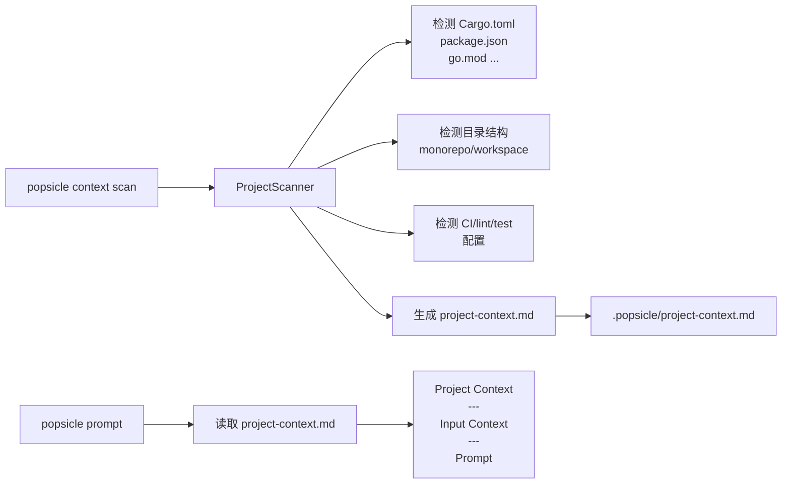

# Project Context as Persistent Ground Truth

## 概述

根据设计哲学第 11 条，引入项目技术画像的自动扫描、持久化和注入机制。核心变更分三层：扫描引擎（core）、CLI 命令、prompt 注入。

## 架构变更




## 1. Core 层：项目扫描器

**新文件** `[crates/popsicle-core/src/scanner.rs](crates/popsicle-core/src/scanner.rs)`

实现 `ProjectScanner` struct，包含以下探测器（detector），每个返回结构化数据：

- **LanguageDetector**: 扫描 `Cargo.toml`、`package.json`、`go.mod`、`pyproject.toml`、`requirements.txt`、`pom.xml`、`build.gradle(.kts)` 等，提取语言、版本、关键依赖
- **StructureDetector**: 检测 monorepo（Cargo workspace members、npm workspaces）、目录组织模式（`src/`、`crates/`、`packages/`、`services/`）
- **ToolchainDetector**: 检测 CI（`.github/workflows/`、`.gitlab-ci.yml`）、lint（`.eslintrc`、`rustfmt.toml`、`clippy.toml`）、测试框架（从依赖中推断）
- **render()**: 将检测结果渲染为结构化 Markdown

生成的 Markdown 模板：

```markdown
# Project Context

> Auto-generated by `popsicle context scan`. You may edit this file freely.

## Tech Stack
- **Language**: Rust 1.xx (2021 edition)
- **Framework**: Tauri, Clap, Serde
- **Build**: Cargo workspace

## Project Structure
- **Type**: Monorepo (Cargo workspace)
- **Crates**: popsicle-core, popsicle-cli
- ...

## Development Practices
- **CI**: GitHub Actions
- **Linting**: clippy, rustfmt
- **Testing**: cargo test (built-in)

## Key Dependencies
- clap 4.x — CLI framework
- serde — Serialization
- ...

## Notes
(Add project-specific context here)
```

**关键设计约束**：

- `scan` 命令检查文件是否已存在。若存在，**不覆盖**，输出提示用户用 `--force` 重新生成
- 扫描纯粹基于文件系统检测，不执行任何构建命令
- 尽量精简输出，避免噪声（不列出所有 dependencies，只列关键的）

## 2. ProjectLayout 扩展

**文件** `[crates/popsicle-core/src/storage/mod.rs](crates/popsicle-core/src/storage/mod.rs)`

在 `ProjectLayout` 中增加：

```rust
pub fn project_context_path(&self) -> PathBuf {
    self.root.join("project-context.md")
}
```

## 3. CLI 层：context 命令重构

**文件** `[crates/popsicle-cli/src/commands/context.rs](crates/popsicle-cli/src/commands/context.rs)`

将现有 `context` 从单命令改为子命令组：

- `popsicle context show` — 原有的 pipeline context 输出（保持完全兼容）
- `popsicle context scan` — 新增，扫描项目并生成 `project-context.md`
  - `--force` 标志：覆盖已有文件

**文件** `[crates/popsicle-cli/src/commands/mod.rs](crates/popsicle-cli/src/commands/mod.rs)`

将 `Context(context::ContextArgs)` 改为 `#[command(subcommand)] Context(context::ContextCommand)`。

## 4. Prompt 注入

**文件** `[crates/popsicle-cli/src/commands/prompt.rs](crates/popsicle-cli/src/commands/prompt.rs)`

在 `execute()` 中，组装 `full_prompt` 之前，检查 `.popsicle/project-context.md` 是否存在，若存在则读取内容，放在最前面（low relevance 位置，背景铺垫）：

```
## Project Context (background)
{project-context.md content}

---

## Input Context (from upstream skills)
{upstream documents}

---

{prompt instruction}
```

这样 project context 在 attention 最弱的前部位置（符合 U 型 attention 设计），不会抢占 high relevance 上游文档和 prompt 指令的 attention。

JSON 输出中新增 `project_context` 字段。

## 5. 模块注册

**文件** `[crates/popsicle-core/src/lib.rs](crates/popsicle-core/src/lib.rs)`

注册 `pub mod scanner;`

## 不做的事

- **不自动重新扫描**：设计明确要求按需更新
- **不在 Guard 中使用 project context**：列为开放问题，不在此次实现
- **不在 config.toml 中声明技术栈**：列为开放问题

