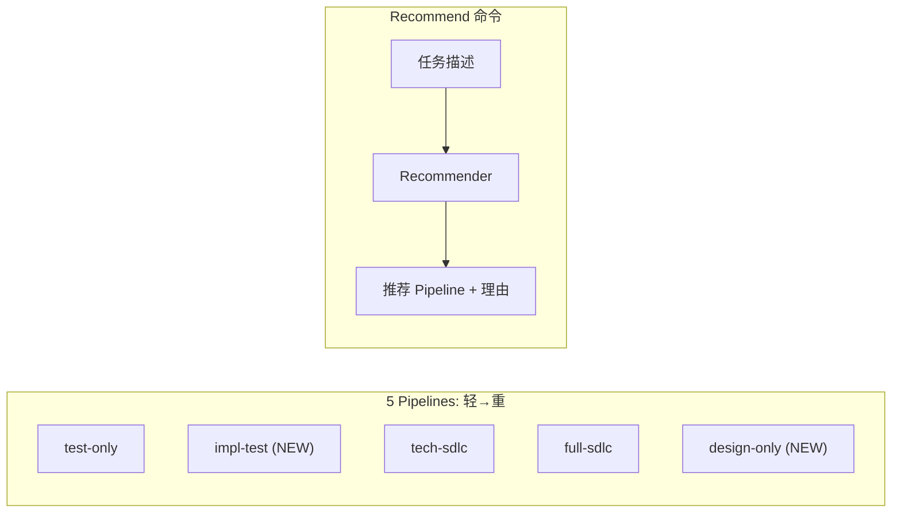

# Scale-Adaptive Pipeline Selection

## 背景

当前有 3 条 Pipeline（`full-sdlc`、`tech-sdlc`、`test-only`），但复杂度谱上存在 gap：缺少"设计已完成直接实现+测试"和"仅做前期规划不实现"两个场景。同时用户需要自行判断该用哪条 Pipeline。

## 变更概览




## 1. 新增 2 条 Pipeline YAML

### `pipelines/impl-test.pipeline.yaml`（实现+测试）

适用场景：设计已明确（有 RFC/ADR），直接编码和测试。

```yaml
name: impl-test
description: Implementation and testing — skip requirements and design phases
stages:
  - name: implementation
    skill: implementation
    description: Code implementation guided by existing design documents
  - name: test-codegen
    skills: [unit-test-codegen, api-test-codegen, e2e-test-codegen]
    description: Generate and run test code against implementation
    depends_on: [implementation]
  - name: quality
    skills: [bug-tracker, test-report]
    description: Bug tracking and test report analysis
    depends_on: [test-codegen]
```

### `pipelines/design-only.pipeline.yaml`（仅设计规划）

适用场景：前期规划和架构探索，不涉及实现。

```yaml
name: design-only
description: Design and planning only — product debate through technical design, no implementation
stages:
  - name: product-debate
    skill: product-debate
    description: Multi-persona product debate
  - name: product
    skill: prd
    description: Product requirements document
    depends_on: [product-debate]
  - name: arch-debate
    skill: arch-debate
    description: Multi-persona architecture debate
    depends_on: [product]
  - name: tech-design
    skills: [rfc, adr]
    description: Technical RFC and Architecture Decision Record
    depends_on: [arch-debate]
```

## 2. PipelineDef 扩展 — 添加推荐元数据

在 [crates/popsicle-core/src/model/pipeline.rs](crates/popsicle-core/src/model/pipeline.rs) 的 `PipelineDef` 中添加可选字段：

```rust
pub struct PipelineDef {
    pub name: String,
    pub description: String,
    pub stages: Vec<StageDef>,
    #[serde(default)]
    pub keywords: Vec<String>,       // 用于匹配任务描述
    #[serde(default)]
    pub scale: Option<String>,       // "minimal" | "light" | "standard" | "full" | "planning"
}
```

同时在 5 条 pipeline YAML 中添加这些字段（例如 `full-sdlc` 添加 `keywords: [feature, user story, product, 功能, 需求]`，`scale: full`）。

## 3. 推荐引擎 — `PipelineRecommender`

在 [crates/popsicle-core/src/engine/](crates/popsicle-core/src/engine/) 下新增 `recommender.rs`：

- `PipelineRecommender::recommend(task: &str, pipelines: &[PipelineDef]) -> Recommendation`
- 匹配逻辑：
  1. 对任务描述做分词 + 小写化
  2. 按优先级从轻到重匹配各 Pipeline 的 keywords
  3. 无匹配时 fallback 到 `tech-sdlc`
- `Recommendation` 结构体包含 `pipeline_name`、`reason`、`alternatives`（次优选择列表）
- 在 `engine/mod.rs` 中 pub use

## 4. CLI 命令 — `popsicle pipeline recommend`

在 [crates/popsicle-cli/src/commands/pipeline.rs](crates/popsicle-cli/src/commands/pipeline.rs) 的 `PipelineCommand` 枚举中添加：

```rust
/// Recommend the best pipeline for a task based on its description
Recommend {
    /// Task description (e.g. "add user authentication feature")
    task: String,
},
```

输出格式：

- **Text**: 推荐结果 + 理由 + 替代方案 + 启动命令
- **JSON**: `{ "recommended": "tech-sdlc", "reason": "...", "alternatives": [...], "cli_command": "popsicle pipeline run tech-sdlc --title ..." }`

## 5. 各 Pipeline 的 keywords 和 scale 配置


| Pipeline      | scale    | keywords                                                |
| ------------- | -------- | ------------------------------------------------------- |
| `test-only`   | minimal  | test, coverage, 测试, 覆盖率                                 |
| `impl-test`   | light    | implement, coding, 实现, 编码, small, 小需求                   |
| `tech-sdlc`   | standard | refactor, migrate, upgrade, 重构, 迁移, 架构, infrastructure  |
| `full-sdlc`   | full     | feature, user story, product, 功能, 需求, 新功能, cross-module |
| `design-only` | planning | plan, explore, evaluate, design, 规划, 探索, 可行性, 评估        |


## 文件变更清单

- **新建**: `pipelines/impl-test.pipeline.yaml`
- **新建**: `pipelines/design-only.pipeline.yaml`
- **修改**: `pipelines/full-sdlc.pipeline.yaml` — 添加 keywords/scale
- **修改**: `pipelines/tech-sdlc.pipeline.yaml` — 添加 keywords/scale
- **修改**: `pipelines/test-only.pipeline.yaml` — 添加 keywords/scale
- **修改**: `crates/popsicle-core/src/model/pipeline.rs` — PipelineDef 添加 keywords/scale 字段
- **新建**: `crates/popsicle-core/src/engine/recommender.rs` — 推荐引擎
- **修改**: `crates/popsicle-core/src/engine/mod.rs` — 导出 PipelineRecommender
- **修改**: `crates/popsicle-cli/src/commands/pipeline.rs` — 添加 Recommend 子命令

