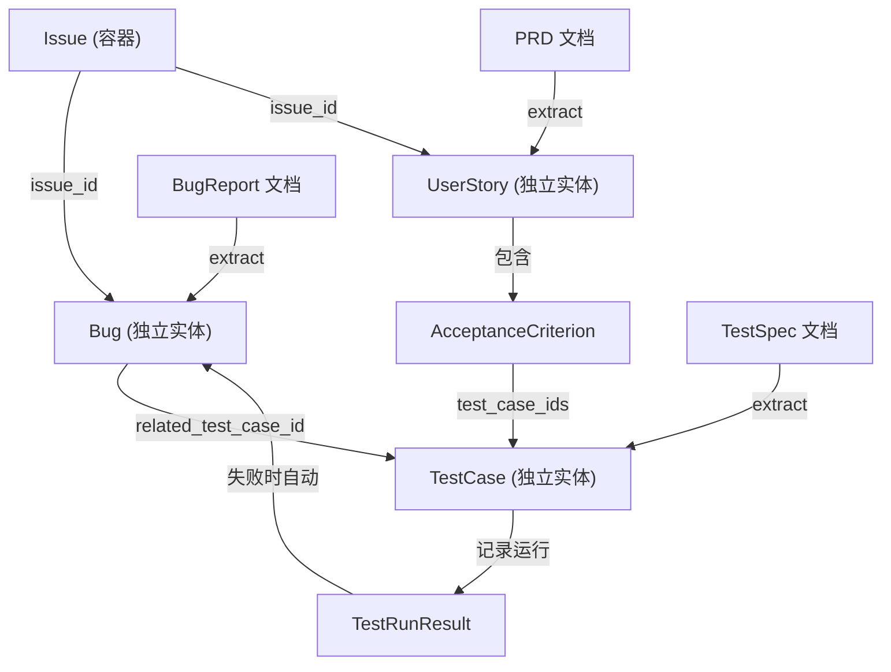
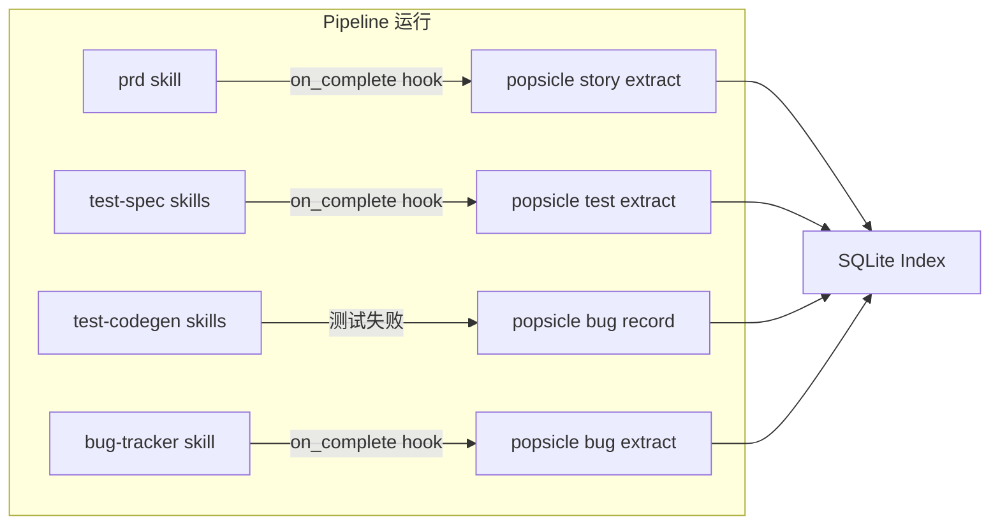

# Work Item Entities: Bug / UserStory / TestCase

## 架构总览




## 数据流




---

## Phase 1: Bug 模型

### 1.1 新增模型 — `crates/popsicle-core/src/model/bug.rs`

```rust
pub struct Bug {
    pub id: String,
    pub key: String,                    // BUG-1
    pub title: String,
    pub description: String,
    pub severity: BugSeverity,          // Blocker, Critical, Major, Minor, Trivial
    pub priority: Priority,             // 复用 issue.rs 中的 Priority
    pub status: BugStatus,              // Open, Confirmed, InProgress, Fixed, Verified, Closed, WontFix
    pub steps_to_reproduce: Vec<String>,
    pub expected_behavior: String,
    pub actual_behavior: String,
    pub environment: Option<String>,
    pub stack_trace: Option<String>,
    pub source: BugSource,              // Manual, TestFailure, DocExtracted
    pub related_test_case_id: Option<String>,
    pub related_commit_sha: Option<String>,
    pub fix_commit_sha: Option<String>,
    pub issue_id: Option<String>,       // 关联的 Issue
    pub pipeline_run_id: Option<String>,
    pub labels: Vec<String>,
    pub created_at: DateTime<Utc>,
    pub updated_at: DateTime<Utc>,
}
```

枚举: `BugSeverity`(blocker/critical/major/minor/trivial), `BugStatus`(open/confirmed/in_progress/fixed/verified/closed/wont_fix), `BugSource`(manual/test_failure/doc_extracted)

在 [crates/popsicle-core/src/model/mod.rs](crates/popsicle-core/src/model/mod.rs) 注册模块导出。

### 1.2 存储层 — [crates/popsicle-core/src/storage/index.rs](crates/popsicle-core/src/storage/index.rs)

在 `migrate()` 中追加 `bugs` 表 DDL:

```sql
CREATE TABLE IF NOT EXISTS bugs (
    id TEXT PRIMARY KEY,
    key TEXT NOT NULL UNIQUE,
    title TEXT NOT NULL,
    description TEXT NOT NULL DEFAULT '',
    severity TEXT NOT NULL DEFAULT 'major',
    priority TEXT NOT NULL DEFAULT 'medium',
    status TEXT NOT NULL DEFAULT 'open',
    steps_to_reproduce TEXT NOT NULL DEFAULT '[]',
    expected_behavior TEXT NOT NULL DEFAULT '',
    actual_behavior TEXT NOT NULL DEFAULT '',
    environment TEXT,
    stack_trace TEXT,
    source TEXT NOT NULL DEFAULT 'manual',
    related_test_case_id TEXT,
    related_commit_sha TEXT,
    fix_commit_sha TEXT,
    issue_id TEXT,
    pipeline_run_id TEXT,
    labels TEXT NOT NULL DEFAULT '[]',
    created_at TEXT NOT NULL,
    updated_at TEXT NOT NULL
);
CREATE INDEX IF NOT EXISTS idx_bug_key ON bugs(key);
CREATE INDEX IF NOT EXISTS idx_bug_status ON bugs(status);
CREATE INDEX IF NOT EXISTS idx_bug_severity ON bugs(severity);
CREATE INDEX IF NOT EXISTS idx_bug_issue ON bugs(issue_id);
CREATE INDEX IF NOT EXISTS idx_bug_run ON bugs(pipeline_run_id);
```

方法：`next_bug_seq`, `create_bug`, `update_bug`, `get_bug`, `query_bugs(severity, status, issue_id, run_id)`

### 1.3 DTO — [crates/popsicle-core/src/dto.rs](crates/popsicle-core/src/dto.rs)

新增 `BugInfo`(列表) 和 `BugFull`(详情) 结构体，模式与 `IssueInfo`/`IssueFull` 一致。

### 1.4 CLI — 新文件 `crates/popsicle-cli/src/commands/bug.rs`

子命令：

- `bug create --title "..." [--severity major] [--issue <key>] [--run <run-id>]`
- `bug list [--severity <sev>] [--status <status>] [--issue <key>]`
- `bug show <key>`
- `bug update <key> [--status fixed] [--fix-commit <sha>]`
- `bug link <key> --commit <sha>`
- `bug record --from-test <test-case-id> --error "..." [--run <run-id>]` (Phase 4 用)

在 [crates/popsicle-cli/src/commands/mod.rs](crates/popsicle-cli/src/commands/mod.rs) 添加 `Bug` 变体和路由。

### 1.5 Tauri UI — [crates/popsicle-cli/src/ui/commands.rs](crates/popsicle-cli/src/ui/commands.rs)

新增命令：`list_bugs`, `get_bug`, `create_bug`, `update_bug`。在 [crates/popsicle-cli/src/ui/mod.rs](crates/popsicle-cli/src/ui/mod.rs) `invoke_handler` 中注册。

---

## Phase 2: TestCase 模型

### 2.1 新增模型 — `crates/popsicle-core/src/model/testcase.rs`

```rust
pub struct TestCase {
    pub id: String,
    pub key: String,                    // TC-1
    pub title: String,
    pub description: String,
    pub test_type: TestType,            // Unit, Api, E2E, UI
    pub priority_level: TestPriority,   // P0, P1, P2
    pub status: TestCaseStatus,         // Draft, Ready, Automated, Deprecated
    pub preconditions: Vec<String>,
    pub steps: Vec<String>,
    pub expected_result: String,
    pub source_doc_id: Option<String>,
    pub user_story_id: Option<String>,
    pub issue_id: Option<String>,
    pub pipeline_run_id: Option<String>,
    pub labels: Vec<String>,
    pub created_at: DateTime<Utc>,
    pub updated_at: DateTime<Utc>,
}

pub struct TestRunResult {
    pub id: String,
    pub test_case_id: String,
    pub passed: bool,
    pub duration_ms: Option<u64>,
    pub error_message: Option<String>,
    pub commit_sha: Option<String>,
    pub run_at: DateTime<Utc>,
}
```

### 2.2 存储层

两张表：`test_cases` 和 `test_runs`。

`test_cases` 方法：`next_testcase_seq`, `create_test_case`, `update_test_case`, `get_test_case`, `query_test_cases(test_type, priority, status, user_story_id, run_id)`

`test_runs` 方法：`insert_test_run`, `query_test_runs(test_case_id)`, `latest_test_run(test_case_id)`

### 2.3 提取引擎 — 新文件 `crates/popsicle-core/src/engine/extractor.rs`

结构化解析（路径 A），从 test-spec 文档的 Markdown 中提取 test case：

- 解析 H3 标题为 test case title
- 解析 checklist 项为 steps
- 从文档 frontmatter 推断 `test_type`（api/e2e/ui/unit）
- 从文档的 P0/P1/P2 分类节中推断 `priority_level`

公共函数：

- `extract_test_cases(doc: &Document, test_type: TestType) -> Vec<TestCase>`
- `extract_user_stories(doc: &Document) -> Vec<UserStory>` (Phase 3)
- `extract_bugs(doc: &Document) -> Vec<Bug>` (Phase 4)

在 [crates/popsicle-core/src/engine/mod.rs](crates/popsicle-core/src/engine/mod.rs) 添加 `pub mod extractor;` 并导出。

### 2.4 CLI — 新文件 `crates/popsicle-cli/src/commands/test.rs`

子命令：

- `test list [--type e2e] [--priority p0] [--status <s>]`
- `test show <key>`
- `test extract --from-doc <doc-id> [--type e2e]`
- `test run-result <key> --passed/--failed [--commit <sha>] [--error "..."]`
- `test coverage [--run <run-id>]` (展示通过率/覆盖率摘要)

### 2.5 DTO + Tauri

DTO：`TestCaseInfo`, `TestCaseFull`, `TestRunInfo`, `TestCoverageSummary`

Tauri 命令：`list_test_cases`, `get_test_case`, `get_test_coverage`

---

## Phase 3: UserStory 模型

### 3.1 新增模型 — `crates/popsicle-core/src/model/story.rs`

```rust
pub struct UserStory {
    pub id: String,
    pub key: String,                    // US-1
    pub title: String,
    pub description: String,
    pub persona: String,
    pub goal: String,
    pub benefit: String,
    pub priority: Priority,
    pub status: UserStoryStatus,        // Draft, Accepted, Implemented, Verified
    pub source_doc_id: Option<String>,
    pub issue_id: Option<String>,
    pub pipeline_run_id: Option<String>,
    pub acceptance_criteria: Vec<AcceptanceCriterion>,
    pub created_at: DateTime<Utc>,
    pub updated_at: DateTime<Utc>,
}

pub struct AcceptanceCriterion {
    pub id: String,
    pub description: String,
    pub verified: bool,
    pub test_case_ids: Vec<String>,
}
```

### 3.2 存储层

两张表：`user_stories` 和 `acceptance_criteria`。

方法：`next_story_seq`, `create_user_story`, `update_user_story`, `get_user_story`, `query_user_stories`, `upsert_acceptance_criterion`, `link_ac_to_test_case`

### 3.3 提取引擎

在 `extractor.rs` 中实现 `extract_user_stories(doc: &Document)`：

- 解析 PRD 文档的 `## User Stories & Acceptance Criteria` section
- 识别 `### Story N: [Title]` 模式
- 解析 `**As a** ... **I want to** ... **So that** ...` 模式提取 persona/goal/benefit
- 解析 `- [ ]` checklist 为 AcceptanceCriterion

### 3.4 CLI — 新文件 `crates/popsicle-cli/src/commands/story.rs`

子命令：

- `story list [--issue <key>] [--status <s>]`
- `story show <key>`
- `story create --title "..." [--issue <key>] [--persona "..."]`
- `story extract --from-doc <doc-id>`
- `story update <key> --status accepted`
- `story link <key> --test-case <tc-key>` (将 AC 关联到 TestCase)

### 3.5 DTO + Tauri

DTO：`UserStoryInfo`, `UserStoryFull`, `AcceptanceCriterionInfo`

Tauri 命令：`list_user_stories`, `get_user_story`

---

## Phase 4: 自动提取 + 闭环

### 4.1 统一提取命令 — 新文件 `crates/popsicle-cli/src/commands/extract.rs`

```
popsicle extract user-stories --from-doc <doc-id>
popsicle extract test-cases --from-doc <doc-id> [--type e2e]
popsicle extract bugs --from-doc <doc-id>
```

内部调用 `extractor.rs` + 写入 SQLite。这也是 hook 中调用的命令。

### 4.2 Skill Hook 配置

更新以下 skill.yaml 的 `hooks.on_complete`:


| Skill                                                                        | Hook                                                                  |
| ---------------------------------------------------------------------------- | --------------------------------------------------------------------- |
| [skills/prd/skill.yaml](skills/prd/skill.yaml)                               | `popsicle extract user-stories --from-doc $POPSICLE_DOC_ID`           |
| [skills/api-test-spec/skill.yaml](skills/api-test-spec/skill.yaml)           | `popsicle extract test-cases --from-doc $POPSICLE_DOC_ID --type api`  |
| [skills/e2e-test-spec/skill.yaml](skills/e2e-test-spec/skill.yaml)           | `popsicle extract test-cases --from-doc $POPSICLE_DOC_ID --type e2e`  |
| [skills/priority-test-spec/skill.yaml](skills/priority-test-spec/skill.yaml) | `popsicle extract test-cases --from-doc $POPSICLE_DOC_ID --type unit` |
| [skills/ui-test/skill.yaml](skills/ui-test/skill.yaml)                       | `popsicle extract test-cases --from-doc $POPSICLE_DOC_ID --type ui`   |
| [skills/bug-tracker/skill.yaml](skills/bug-tracker/skill.yaml)               | `popsicle extract bugs --from-doc $POPSICLE_DOC_ID`                   |


### 4.3 测试失败 → Bug 自动创建

`bug record` 子命令（Phase 1.4 中预定义）：

```bash
popsicle bug record --from-test TC-5 --error "assertion failed: expected 200 got 500" --run <run-id>
```

逻辑：

1. 查找 TestCase TC-5
2. 创建 TestRunResult (passed=false)
3. 检查是否已有相同 test_case_id 的 Open Bug（去重）
4. 若无，创建新 Bug，自动关联 `related_test_case_id`

### 4.4 HookContext 扩展 — [crates/popsicle-core/src/engine/hooks.rs](crates/popsicle-core/src/engine/hooks.rs)

当前 `HookContext::from_document` 已提供 `POPSICLE_DOC_ID`、`POPSICLE_RUN_ID` 等环境变量，无需修改。extract 命令通过这些环境变量获取上下文。

### 4.5 Issue 关联传播

当 `popsicle issue start` 创建 pipeline run 后，通过 `pipeline_run_id` 自动将提取出的 UserStory/TestCase/Bug 关联到 Issue。在 extract 命令中：

- 通过 `$POPSICLE_RUN_ID` 查找关联的 Issue (`find_issue_by_run_id`)
- 将 `issue_id` 写入新创建的实体

---

## 文件变更总览

### 新文件 (8)

- `crates/popsicle-core/src/model/bug.rs`
- `crates/popsicle-core/src/model/testcase.rs`
- `crates/popsicle-core/src/model/story.rs`
- `crates/popsicle-core/src/engine/extractor.rs`
- `crates/popsicle-cli/src/commands/bug.rs`
- `crates/popsicle-cli/src/commands/test.rs`
- `crates/popsicle-cli/src/commands/story.rs`
- `crates/popsicle-cli/src/commands/extract.rs`

### 修改文件 (8)

- [crates/popsicle-core/src/model/mod.rs](crates/popsicle-core/src/model/mod.rs) — 注册 3 个新模块
- [crates/popsicle-core/src/engine/mod.rs](crates/popsicle-core/src/engine/mod.rs) — 导出 extractor
- [crates/popsicle-core/src/storage/index.rs](crates/popsicle-core/src/storage/index.rs) — 4 张新表 + CRUD 方法
- [crates/popsicle-core/src/dto.rs](crates/popsicle-core/src/dto.rs) — 新增 DTO 类型
- [crates/popsicle-cli/src/commands/mod.rs](crates/popsicle-cli/src/commands/mod.rs) — 注册 4 个新命令模块
- [crates/popsicle-cli/src/ui/commands.rs](crates/popsicle-cli/src/ui/commands.rs) — Tauri 命令
- [crates/popsicle-cli/src/ui/mod.rs](crates/popsicle-cli/src/ui/mod.rs) — invoke_handler 注册
- 6 个 `skills/*/skill.yaml` — 添加 on_complete hook

