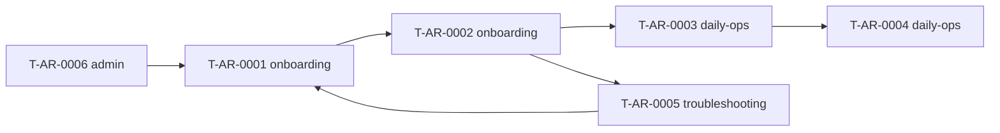

# PRD Overview — Agent Runtime 手机远程派活

> **Status**: Review
> **Target Product**: `agent-runtime`
> **Source Debate**: doc-181.product-debate.md
> **PDR**: PDR-001-agent-runtime-mvp.md
> **Quality Score**: 92/100
> **Last-Updated**: 2026-07-06

## 1. 本次变更的核心意图

用户能在手机创建派活；本机 Daemon 自动执行 popsicle pipeline 并调 Agent CLI，无需在 Cursor 手动跑 `pipeline next`。

## 1b. 旅程与 Task 关系

## 2. Problem Statement

见 `products/agent-runtime/PRODUCT.md` § Problem Statement。

`Decision-Ref: PDR-001`

## 3. Success Metrics

见 `products/agent-runtime/PRODUCT.md` § Success Metrics。

`Decision-Ref: PDR-001`

## 4. 文件清单

### 新增 Tasks

| Task ID | 标题 | Journey | 路径 |
|---|---|---|---|
| T-AR-0001 | 安装并启动 Daemon | onboarding | tasks/onboarding/T-AR-0001-install-daemon.md |
| T-AR-0002 | 首次手机派活 | onboarding | tasks/onboarding/T-AR-0002-first-mobile-dispatch.md |
| T-AR-0003 | 查看 pipeline 进度 | daily-ops | tasks/daily-ops/T-AR-0003-view-run-progress.md |
| T-AR-0004 | 手机批准 stage | daily-ops | tasks/daily-ops/T-AR-0004-mobile-stage-approval.md |
| T-AR-0005 | 派活失败诊断 | troubleshooting | tasks/troubleshooting/T-AR-0005-dispatch-failure-diagnosis.md |
| T-AR-0006 | 自托管 Server | admin | tasks/admin/T-AR-0006-self-host-server.md |

### PRODUCT.md / PDR / Intent

- products/agent-runtime/PRODUCT.md
- products/agent-runtime/decisions/pdr/PDR-001-agent-runtime-mvp.md
- products/agent-runtime/intents/acceptance.intent
- products/agent-runtime/intents/invariants.intent
- products/agent-runtime/tasks/README.md

## 5. User Intents Catalog

见 PRODUCT.md § User Intents Catalog。

## 6. Intent Mapping

| # | 核心声明 | intent 层 | Task |
|---|---|---|---|
| 1 | Runtime 注册并 online | acceptance | T-AR-0001 |
| 2 | Runtime online 时派活入队 | acceptance | T-AR-0002 |
| 3 | Runtime offline 拒绝派活 | acceptance | T-AR-0005 |
| 4 | 手机批准产生 confirm 任务 | acceptance | T-AR-0004 |
| 5 | 密钥与代码不离开 Runtime 机 | invariants | 跨 task |
| 6 | Daemon subprocess 调 popsicle | contracts | T-AR-0001 | ADR 候选 |

## 7. Out of Tasks

- 云端 GPU Agent
- legacy sync 复活
- Multica 双栈（P3 再评估）

## 8. Quality Checklist

- [x] task-centric §4 Tasks
- [x] 每个 task ≤250 行
- [x] Intent Mapping ↔ acceptance 种子 4 block 双射
- [x] PDR Consequences 与文件清单一致
- [x] 无历史/将来叙事

## Core Intent

用户能在手机派活，本机 Daemon 驱动 popsicle + Agent CLI 完成 IDD pipeline。

## Problem Statement

IDD pipeline 依赖桌面手动 CLI；agent-runtime 提供远程派活与 Daemon 执行面。

## File Manifest

见 §4 文件清单。

## User Intents Catalog

见 PRODUCT.md。

## Intent Mapping

见 §6。

## Review Checklist

- [x] 五件套已落盘 products/agent-runtime/
- [x] debate 结论方案 A  faithfully 反映
- [x] contracts 仅标注 ADR 候选
