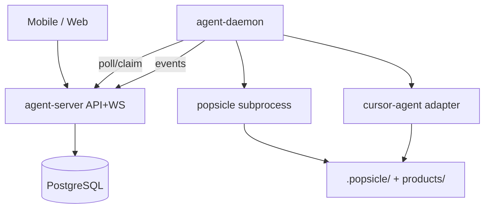

# RFC Draft: agent-runtime 执行面分层

## Context

PDR-001 要求手机派活 + 本机 Daemon 调 popsicle 与 Agent CLI。现有 `cli-ux` 为命令壳，`skill-runtime` 为 pipeline 状态机，均不宜吞并 Server 与长驻 Daemon。

## Goals / Non-Goals

**Goals**
- Server：task queue、WS 推送、设备鉴权、run 镜像只读 API
- Daemon：轮询认领、subprocess popsicle、spawn Agent CLI adapter、心跳
- cli-ux：`popsicle daemon start|status|logs|stop`

**Non-Goals**
- Server 上执行 AI 或持有 API Key
- 复活 legacy popsicle-sync
- P0 Squad 多 Agent 路由

## Quality Attributes

| 属性 | 目标 | 守护 |
|---|---|---|
| 派活到 running | p95 ≤ 60s `[假设]` | e2e dogfood |
| Daemon 心跳 | 15s | 集成测试 |
| 安全 | 威胁：Server 泄露 workspace 路径 | 最小元数据 |

## Proposed Design

**模块边界**
- `crates/agent-server`：HTTP Chi、task 状态机、JWT 设备会话
- `crates/agent-daemon`：Runtime 注册、prompt 组装（读 intent-coder guide）、并发池
- `crates/cli-ux`：`daemon` 子命令调用 agent-daemon 库（thin）

## Alternatives Considered

| 方案 | 否决理由 |
|---|---|
| 全进 cli-ux | 违反 IO shell 边界，CI 二进制膨胀 |
| Multica 桥接 | 双 Issue 模型 |

## Intent & Decision Mapping

| 声明 | intent 层 | 载体 |
|---|---|---|
| Daemon 以 subprocess 调用 workspace popsicle | contracts | ADR-001 |
| Server 不执行 Agent 任务 | invariants | ADR-001 |
| task 状态 queued→dispatched→running→terminal | contracts | ADR-001 |
| 仅 IDD pipeline 派活 | charter | CADR-001 |

**ADR 候选**：ADR-001 agent-runtime 执行面分层
**CADR 候选**：CADR-001 IDD-only managed dispatch

## Risks & Mitigations

| 风险 | 缓解 |
|---|---|
| 镜像与本地 state 漂移 | P0 以本地为准；Server 标 stale |
| prompt deferred | daemon 直读 intent-coder 文件 |

## Migration / Rollout

P0：opt-in compose；不影响无 daemon 的现有 popsicle 用户。

## Open Questions

- [ ] PostgreSQL vs SQLite on server（P0 建议 PG）
- [ ] Mobile PWA vs 原生（产品 P1）

## References

- doc-185 arch-debate
- doc-184 prd-writer
- PDR-001
