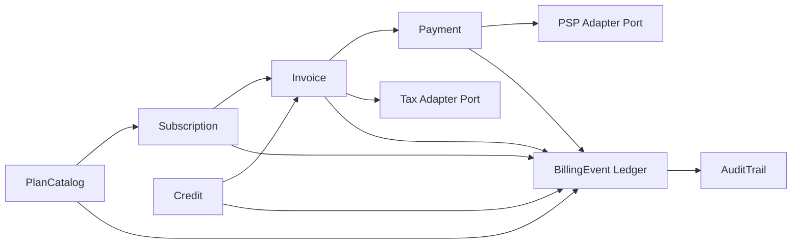

---
artifact: rfc
slug: saas-billing-core-boundaries-rfc
title: "SaaS billing core boundaries and event ledger"
target_product: saas-billing-module
status: Proposed
generated_by: rfc-writer
date: 2026-06-10
related_adrs: [ADR-001]
related_prd: "saas-billing-module-prd-task-graph.prd.md"
quality_score: 93
query_anchors:
  - "SaaS billing core 为什么使用 BillingEvent ledger？"
  - "PSP adapter 为什么不能直接改 invoice？"
  - "Tax adapter 和 billing core 的边界是什么？"
---

# RFC: SaaS billing core boundaries and event ledger

> 正式技术设计文档。由 rfc-writer 从 arch-debate 的 rfc-draft 打磨而来，质量评分 93/100。
> 现在时书写；本文 § File Manifest 列出的段落可直接合并进 ARCHITECTURE.md。

## Context

`saas-billing-module` 是 greenfield billing product。PRD 要求 plan catalog、subscriptions、invoices、payment retries、credits、tax-ready audit trail，并要求核心 billing invariants 可被 intent 验证。架构辩论选择 modular monolith + append-only BillingEvent ledger，避免首版 service split，同时保留清晰模块契约。

Fact basis: Product Brief + `saas-billing-module-prd-task-graph.prd.md` + `saas-billing-module-architecture-debate.arch-debate.md`。PSP provider behavior、tax service schema、persistence model、capacity 和 SLA 均为 `[待验证]`。

## Goals

- Define PlanCatalog, Subscription, Invoice, Payment, Credit, AuditTrail, and BillingEvent Ledger boundaries.
- Ensure amount-changing operations append auditable BillingEvent records.
- Keep PSP and Tax integrations behind adapter ports.
- Produce contracts.intent seed blocks awaiting ADR-001.

## Non-Goals

- PSP-specific API mapping.
- Tax-rate calculation.
- Revenue recognition or accounting journal entries.
- Service-per-domain deployment split.
- Metered usage rating and multi-currency settlement.

## Quality Attributes (NFR)

| Attribute | Target | Guard |
|---|---|---|
| Correctness | invoice, credit, payment changes flow through event-backed commands | contracts + invariants intent |
| Auditability | every amount-changing event has actor, reason, timestamp, source object | acceptance/contracts intent |
| Evolvability | core modules depend on ports, not PSP/tax vendor SDKs | ADR-001 review |
| Operability | adapter failures produce observable retryable outcomes | logs/metrics `[待验证]` |
| Performance | invoice/audit read models can be projected from BillingEvent | benchmark/SLO `[待验证]` |

## Proposed Design

### Module Contracts

| Module | Owns | Does Not Own |
|---|---|---|
| PlanCatalog | sellable plan metadata, billing interval, tax-ready plan fields | subscription state |
| Subscription | customer-plan lifecycle and status-change events | invoice totals |
| Invoice | line items, supplied tax amount, applied credits, adjustments, total projection | PSP calls |
| Payment | payment attempts, failure state, retry schedule, PSP adapter calls | invoice mutation bypass |
| Credit | issued credit, remaining balance, application commands | invoice line item authorship |
| AuditTrail | query/export over BillingEvent and source references | tax filing |
| BillingEvent Ledger | append-only amount/status events | accounting journal semantics |

### Adapter Contracts

- PSP adapter reports payment outcomes. It cannot mutate invoice totals directly.
- Tax adapter supplies tax amount, jurisdiction, and taxable basis fields. Billing core does not calculate tax rates.
- Adapter failures become events or retryable outcomes; they do not silently alter invoice/payment state.

## Alternatives Considered

| Option | Rejection Reason |
|---|---|
| Service-per-domain + integration events | Operationally heavy for greenfield first spec; service split can follow after contracts stabilize |
| Invoice-centric CRUD core | Fastest path, but weak auditability and paid invoice immutability |

## Intent & Decision Mapping

| Core Technical Statement | Target Intent Layer | Decision Carrier | contracts goal | Notes |
|---|---|---|---|---|
| Billing core records amount-changing operations as append-only BillingEvent | `contracts.intent` / `invariants.intent` | ADR-001 | `BillingCoreUsesAppendOnlyEvents` | unlock after ADR |
| Invoice projection derives from line items, tax amount, applied credits, adjustments | `contracts.intent` | ADR-001 | `InvoiceProjectionUsesEventBackedAmounts` | supports invoice invariant |
| Credit application appends event and updates projected remaining balance | `contracts.intent` | ADR-001 | `CreditApplicationUsesEventBackedBalance` | supports credit invariant |
| PSP adapter cannot mutate invoices directly | `contracts.intent` | ADR-001 | `PspAdapterCannotMutateInvoice` | PSP behavior `[待验证]` |
| Tax adapter supplies tax data; billing core does not calculate rates | `contracts.intent` | ADR-001 | `TaxAdapterSuppliesTaxDataOnly` | tax service `[待验证]` |

## Risks & Mitigations

| Risk | Trigger | Mitigation |
|---|---|---|
| BillingEvent becomes accidental accounting ledger | revenue recognition enters billing core | keep accounting journal out of scope; future PDR/ADR |
| Adapter behavior leaks into core | vendor SDK objects appear in domain modules | contracts forbid vendor SDK types at core boundary |
| Tax-ready is treated as tax-compliant | users expect tax filing output | RFC states tax calculation and filing are non-goals |
| Projection consistency is ambiguous | read model lags command write | rfc-writer marks consistency model `[待验证]`; future ADR can refine |

## Migration / Rollout

Greenfield starts as modular monolith. Service split is a future ADR after event schema and contracts stabilize. No legacy migration is required.

## File Manifest

### ARCHITECTURE.md top-level increment
- [x] `products/saas-billing-module/ARCHITECTURE.md` § Core Boundary — create.
- [x] `products/saas-billing-module/ARCHITECTURE.md` § Billing Event Ledger — create.
- [x] `products/saas-billing-module/ARCHITECTURE.md` § Adapter Ports — create.

### Intent files
- [x] `products/saas-billing-module/intents/contracts.intent` create seed goals awaiting ADR-001.

### Decision records
- [x] `products/saas-billing-module/decisions/adr/ADR-001-saas-billing-core-boundaries.md` create Proposed skeleton.

## Quality Score

| Dimension | Score | Notes |
|---|---:|---|
| Completeness | 24/25 | covers context, goals, design, alternatives, risks, rollout |
| Clarity | 19/20 | module and adapter boundaries explicit |
| Verifiability | 23/25 | contracts seed maps to decision rows; NFRs kept out of intent |
| IDD Fit | 27/30 | ADR/File Manifest/contracts mirror aligned |
| **Total** | **93/100** | Pass |

## Quality Checklist

- [x] Four dimensions scored, total >= 90.
- [x] Contracts seed is goal/comment seed awaiting ADR.
- [x] No performance/latency target is placed in contracts.
- [x] File Manifest mirrors ADR Consequences.
- [x] Intent & Decision Mapping rows have ADR-001 as decision carrier.

## References

- **Source RFC Draft**: `saas-billing-module-architecture-debate.rfc-draft.md`
- **Source Debate**: `saas-billing-module-architecture-debate.arch-debate.md`
- **Decision Matrix**: `saas-billing-module-architecture-debate.tech-decision-matrix.md`
- **PRD Overview**: `saas-billing-module-prd-task-graph.prd.md`
- **Fact Basis**: PRD Overview / Product Brief

## Review Checklist

- [x] RFC § File Manifest 与 ADR Consequences 完全一致
- [x] 每个 contracts goal 块对应 Intent & Decision Mapping 一行
- [x] ADR 骨架 Status: Proposed，ID 不与现有冲突
- [x] CADR 候选：无
- [x] RFC 质量评分 ≥ 90
- [x] 已向用户展示三件套完整产出（artifact + product files）
