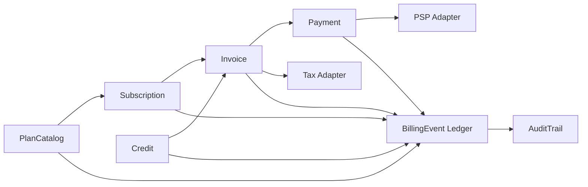

# RFC Draft: SaaS billing core boundaries and event ledger

> This is the arch-debate draft, not the final RFC. It uses present-tense architecture text and feeds rfc-writer.

## Context

The PRD defines a greenfield SaaS billing module covering plan catalog, subscriptions, invoices, payment retries, credits, and tax-ready audit trail. The product requires intent-verifiable billing invariants: invoice total balances, credit application stays within remaining balance, paid invoice changes require adjustment and audit event, and payment failures expose retry status.

Fact basis: Product Brief + `saas-billing-module-prd-task-graph.prd.md`. PSP provider behavior, tax service behavior, persistence model, capacity, and SLA are `[待验证]`.

## Goals / Non-Goals

**Goals**
- Define stable module boundaries for PlanCatalog, Subscription, Invoice, Payment, Credit, and AuditTrail.
- Define BillingEvent ledger as the common trace for amount-changing operations.
- Define PSP adapter and Tax adapter responsibilities without binding a vendor.
- Produce contracts candidates for rfc-writer and adr-writer.

**Non-Goals**
- PSP-specific API mapping.
- Tax rate calculation.
- Revenue recognition / accounting journal entries.
- Service-per-domain deployment split.

## Quality Attributes

| Attribute | Target | Guard |
|---|---|---|
| Correctness | Amount-changing commands append auditable events | contracts/invariants intent |
| Auditability | Every invoice/payment/credit state transition traces to source object | acceptance/contracts intent |
| Evolvability | Core depends on adapter ports, not vendor SDKs | ADR + contracts intent |
| Operability | Payment retry status and adapter failures are observable | acceptance intent + logs/metrics `[待验证]` |
| Performance | Read models can be projected from BillingEvent | benchmark/SLO `[待验证]` |

## Proposed Design

### Module Contracts

- `PlanCatalog` owns sellable plans and tax-ready metadata required for invoice creation.
- `Subscription` owns customer-plan lifecycle and emits status-change events.
- `Invoice` owns invoice line items, tax amount supplied by adapter, applied credits, adjustments, and total projection.
- `Payment` owns payment attempts, failure state, retry schedule, and PSP adapter calls.
- `Credit` owns issued credit, remaining balance, and application commands.
- `AuditTrail` owns query/export over BillingEvent and source-object references.
- `BillingEvent Ledger` is append-only for amount-changing events and status transitions relevant to audit.

### Adapter Boundaries

- PSP adapter reports payment outcomes; it cannot mutate invoice totals directly.
- Tax adapter supplies tax amount / jurisdiction metadata; billing core does not calculate tax rates.
- Adapter failures are events or retryable outcomes, not silent state changes.

## Alternatives Considered

| Option | Rejection Reason |
|---|---|
| Service-per-domain + integration events | Too much operational overhead for greenfield first spec; can be revisited after contracts stabilize |
| Invoice-centric CRUD core | Fast to implement but weak for auditability and paid invoice immutability |

## Intent & Decision Mapping

| Core Technical Statement | Target Intent Layer | Decision Carrier | Notes |
|---|---|---|---|
| Billing core records amount-changing operations as append-only BillingEvent | `contracts.intent` / `invariants.intent` | ADR-001 | contracts seed after ADR accepted |
| Invoice projection derives from line items, tax amount, applied credits, and adjustments | `contracts.intent` | ADR-001 | supports invoice invariant |
| Credit application appends event and updates projected remaining balance | `contracts.intent` | ADR-001 | supports credit invariant |
| PSP adapter cannot mutate invoices directly | `contracts.intent` | ADR-001 | PSP behavior `[待验证]` |
| Tax adapter supplies tax data; billing core does not calculate rates | `contracts.intent` | ADR-001 | tax service `[待验证]` |

**ADR Candidates**: ADR-001-saas-billing-core-boundaries
**CADR Candidates**: none

## Risks & Mitigations

| Risk | Trigger | Mitigation |
|---|---|---|
| BillingEvent becomes accidental accounting ledger | Teams add revenue recognition requirements | Non-goal in RFC and PDR; separate future PDR |
| Adapter behavior leaks into core | PSP SDK objects enter domain modules | contract forbids vendor SDK types at core boundary |
| Tax-ready is misread as tax-compliant | Tax filing expectations appear | tax calculation non-goal, tax adapter boundary explicit |
| Read projection consistency ambiguity | Event projection lags command write | define consistency model in rfc-writer `[待验证]` |

## Migration / Rollout

Greenfield module starts with modular monolith boundaries. Service split is a future ADR after module contracts and event schemas stabilize.

## Open Questions

- [ ] Exact persistence model for BillingEvent.
- [ ] Consistency model between command write and read projection.
- [ ] PSP retry code taxonomy.
- [ ] Tax adapter response schema.
- [ ] Whether audit export needs immutable external archive.

## References

- **Source Debate**: `saas-billing-module-architecture-debate.arch-debate.md`
- **Decision Matrix**: `saas-billing-module-architecture-debate.tech-decision-matrix.md`
- **PRD Overview**: `saas-billing-module-prd-task-graph.prd.md`
- **Fact Basis**: PRD Overview / Product Brief
