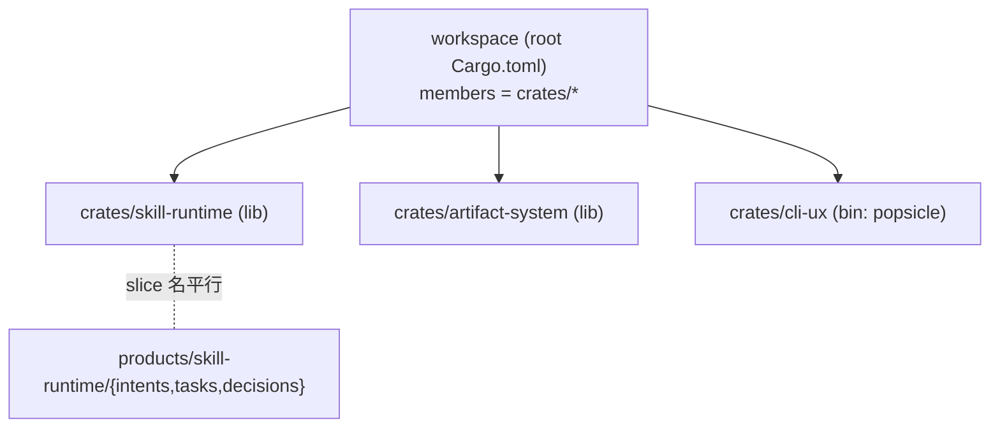

---
artifact: rfc
slug: workspace-layout
title: "workspace 布局：根级 crates/<slice>/ 与 members glob"
target_product: popsicle
status: Proposed              # Proposed → Accepted（随关联 ADR）
generated_by: rfc-writer
date: 2026-06-08
related_adrs: [ADR-003]       # 本 RFC 落地的 ADR ID
related_prd: "skill-runtime.prd.md"
quality_score: 92
query_anchors:
  - "这个技术方案为什么这么设计？"
  - "模块 A 对 B 的契约是什么？"
  - "被否的方案有哪些，为什么？"
---

# RFC: workspace 布局 — 根级 crates/<slice>/ 与 members glob

> 正式技术设计文档。由 rfc-writer 从 arch-debate 的 rfc-draft 打磨而来，质量评分 ≥ 90。
> 现在时书写——本文 § File Manifest 列出的段落可直接合并进 ARCHITECTURE.md。

## Context

root `Cargo.toml` 现为 `members = []`，其注释倾向 `products/<product>/crates/*`，
而 `products/skill-runtime/ARCHITECTURE.md` § File Manifest 写根级 `crates/<name>/`
——**两处自相矛盾**。skill-runtime 切片即将从 `in-progress` 进入 `in-shadow`（见
`migration/progress.md`），实现期第一行 Rust 落地前，必须把 member crate 的物理落点收敛成
单一事实。**关键澄清（用户）**：`skill-runtime / artifact-system / cli-ux` 三个 slice 是
**同一个产品 popsicle** 的切片，**不是三个独立产品**——因此沿用 legacy 的「根级扁平 `crates/`」
约定。事实基：F-legacy = `legacy/popsicle/Cargo.toml` 单 workspace、扁平
`crates/{popsicle-core,popsicle-cli,popsicle-sync}`（sync 已按 PDR-001 砍掉）；F-new =
`products/{skill-runtime,artifact-system,cli-ux}/` 各含 `tasks/decisions/intents/proposals`
文档目录、暂无代码。决策过程见 `workspace-layout.arch-debate.md`（方案 C，置信度 4/5）。

## Goals

- 为 member crate 确立**单一权威落点**，消除 root `Cargo.toml` 与 ARCHITECTURE.md 的矛盾。
- **迁移局部性**：crate = slice = 独立的 shadow/cutover 单元，切换时是一个 crate 的整体替换。
- **legacy 约定一致**：沿用根级扁平 `crates/`，降低迁移期认知成本。
- **零重排可演进**：再加 slice（crate）时不动既有目录。
- `members` 以**单行 glob** `crates/*` 表达。

## Non-Goals

> 明确不解决，防 scope 蔓延。

- 不决定 `crates/skill-runtime` **内部** lib/bin 细分与模块切法——留 adr 批准闸 ratify + 实现细化。
- 不引入跨 slice **共享 crate**（当前无共享需求；真出现时由增量 ADR 增补，仍在 `crates/*` 下）。
- 不改动 `legacy/` 子模块的独立 workspace。
- 不决定 `ADR-skill-runtime-Boundary`（ARCHITECTURE.md 另一条 Open Decision，独立处理）。

## Quality Attributes (NFR)

> 迁移局部性/编译期边界为**质量属性目标**，由 cargo 结构 + CI + migration 看板守护。
> **不进 contracts 种子**（intent-lang 不验目录布局/时间，D2）。

| 属性 | 目标 | 守护手段 |
|---|---|---|
| 迁移局部性 | 每个 slice 是独立 shadow/cutover 单元，切换 = 一个 crate 整体替换 | `migration/progress.md` 看板 + CI |
| 构建边界 | 跨 crate 引用必须经 `workspace.dependencies` 显式声明，无隐式偷引用 | `cargo metadata` 依赖图断言 |
| 可演进性 | 新增 slice（crate）对既有 crate 重排成本 = 0 | CI 结构检查 + code review |

## Proposed Design

**目录形态**：每个 member crate 落在**根级** `crates/<slice>/`（内含 `Cargo.toml` + `src/`），
`<slice>` ∈ `{skill-runtime, artifact-system, cli-ux}`，crate 名即 slice 名。

**workspace 声明**（root `Cargo.toml`）：

```toml
[workspace]
resolver = "2"
members = ["crates/*"]
```

**文档/代码平行对齐**：`products/<slice>/` 承载该 slice 的 IDD 文档
（`intents/tasks/decisions/proposals`），`crates/<slice>/` 承载其代码，二者按 **slice 名同名平行**。

**binary 归属**：`cli-ux` crate 承载 popsicle CLI 二进制；`skill-runtime` / `artifact-system`
为 lib crate（次级细节，待 adr ratify）。

**跨 crate 依赖**：经 `[workspace.dependencies]` 以显式 `path` 声明，依赖方向在 `Cargo.toml` 一眼可查。



## Alternatives Considered

> 3 方案已在 `workspace-layout.arch-debate.md` § Phase 3 多角色评审，无独立 decision-matrix 文件。

| 方案 | 否决理由 |
|---|---|
| 方案 A（每产品 `products/<product>/crates/*`）| 前提是「多产品」；用户澄清三 slice 同属一个产品 popsicle，前提不成立。 |
| 方案 B（根级 `crates/` 按技术层 `popsicle-core`/`-cli`）| 技术层 crate **横跨多个 slice**，与 migration 的逐 slice shadow/cutover 边界不对齐，切换需跨 crate 协调。 |

## Intent & Decision Mapping

> 本 RFC 是**纯目录/构建布局**约定，不对外暴露跨模块 API ⟹ **无 contracts 种子产出**。

| 核心技术声明 | 目标 intent 层 | 决策载体 | contracts goal | 备注 |
|---|---|---|---|---|
| member crate 落根级 `crates/<slice>/`，crate = slice | （不进 intent）| ADR-003 | —— | 布局约定，非对外契约 |
| 跨 crate 依赖经 `workspace.dependencies` 显式声明 | （不进 intent）| ADR-003 | —— | 构建图护栏，cargo 守护 |
| 每 slice 独立 shadow/cutover 边界（crate 整体替换）| （不进 intent）| RFC § NFR | —— | D2：质量属性目标，migration+CI 守护 |

## Risks & Mitigations

| 风险 | 触发条件 | 缓解 |
|---|---|---|
| crate 粒度过粗（一 slice 一 crate）致编译单元大 | slice 代码体量增长 | slice 内可后续拆子 crate（仍在 `crates/*` 下），零顶层重排 |
| 跨 slice 共享代码无处安放 | 出现 ≥2 slice 复用的逻辑 | 增量 ADR 在 `crates/` 下新增共享 crate（如 `crates/popsicle-core`），`members` 不变 |
| `products/<slice>` 与 `crates/<slice>` 名漂移 | 改名只动一边 | CI 校验两树 slice 名集合一致 |

## Migration / Rollout

当前 `members = []`、无任何既有 crate ⟹ **零迁移成本**。首个 crate `crates/skill-runtime`
随 skill-runtime 实现落地时按本布局创建，独立进入 in-shadow。回滚 = 修改 `members` glob
（无数据/代码迁移），低风险。

## File Manifest

> 本 RFC 涉及的全部文件，落地时按此清单分别合并。与 ADR § Consequences 镜像一致。

### ARCHITECTURE.md 顶层增量
- [x] `products/skill-runtime/ARCHITECTURE.md` § File Manifest — 路径明确为根级 `crates/<slice>/`（crate = slice）
- [x] `products/skill-runtime/ARCHITECTURE.md` § Open Decisions — 移除 `[TBD] ADR-Workspace-Layout`，指向 ADR-003（Accepted）
- [x] root `Cargo.toml` — `members = ["crates/*"]`，并改写占位注释（去掉 `products/<product>/crates/*` 倾向）

### Intent 文件
- 无 intent 文件改动：纯布局 RFC，不产 contracts 种子（见 § Intent & Decision Mapping）。

### 决策记录
- [x] `products/skill-runtime/decisions/adr/ADR-003-workspace-layout.md`（Status: Proposed → adr-writer 固化）

## Quality Checklist

- [x] 四维度已评分，总分 = 92 ≥ 90
- [x] contracts 种子 N/A——纯布局 RFC 无 contracts 产出（bypass 理由已记录于 § Intent & Decision Mapping）
- [x] 无性能/时延误塞进 contracts（D2，NFR 仅作质量属性目标）
- [x] File Manifest 与 ADR Consequences 镜像一致
- [x] Intent & Decision Mapping 每行都有决策载体（ADR-003 / RFC § NFR）

## Ingest Checklist

- [x] rfc-draft（= `workspace-layout.arch-debate.md`）已读，且通过 § Intent & Decision Mapping 校验
- [x] decision-matrix 已读——单方案选定，3 方案已在 arch-debate Phase 3 评审，无独立 matrix 文件
- [x] target_product 已锁定（popsicle；决策对全 `crates/<slice>` 通用）
- [x] ADR ID 已分配（decisions/adr/ 现有最大号 ADR-002，+1 = ADR-003）
- [x] CADR 候选已识别——无（不触 charter 铁律/Layer Map，走 ADR）

## Review Checklist

- [x] RFC § File Manifest 与 ADR Consequences 完全一致
- [x] 每个 contracts goal 块对应 Intent & Decision Mapping 一行——N/A，无 contracts 种子
- [x] ADR 骨架 Status: Proposed，ID（ADR-003）不与现有冲突
- [x] CADR 候选（如有）已标明需先走 charter 修订——无 CADR
- [x] RFC 质量评分 92 ≥ 90
- [x] **已向用户展示三件套完整产出**

## References

- **Source Debate**: `workspace-layout.arch-debate.md`（doc f9c75a54）
- **ARCHITECTURE**: `products/skill-runtime/ARCHITECTURE.md` § Open Decisions / File Manifest
- **Workspace 现状**: root `Cargo.toml`（members=[]）、`legacy/popsicle/Cargo.toml`（扁平 crates/）
- **Migration 模型**: `migration/progress.md`（skill-runtime: in-progress → in-shadow；逐 slice 切流）
