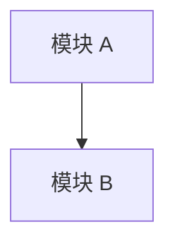

# RFC Draft: {title}

> ⚠️ 这是 **arch-debate 的辩论摘要草稿，不是终态 RFC**。质量门由 rfc-writer 把。
> 现在时书写，语句应能直接粘进 ARCHITECTURE.md。

## Context

{要解决的技术问题 + 现状。legacy 数字/模块名 cite fact-extraction-report / api-contracts；greenfield cite PRD/Product Brief，超出 brief 的判断标 [待验证]。}

## Goals / Non-Goals

**Goals**
- ……

**Non-Goals**（明确不解决，防 scope 蔓延）
- ……

## Quality Attributes（NFR 目标）

> 质量属性目标写在这里 + 由 benchmark/压测守护。**不进 `.intent`**（intent-lang
> 不验时间/容量，D2）。

| 属性 | 目标 | 守护手段 |
|---|---|---|
| 延迟 p95 | …… | 压测断言 |
| 可用性 | …… | SLO 监控 |
| 安全 | 威胁模型见 § Risks | 安全评审 |

## Proposed Design

{推荐方案：模块边界 + 数据流 + 关键接口。}

> 建议 `popsicle tool run mermaid-diagram action=scaffold type=architecture`，供 rfc-writer 打磨。
> 至少画出模块边界 `flowchart` 或主路径 `sequenceDiagram`。

Diagram: {草稿名} (flowchart)

## Alternatives Considered

> 被否方案 + 一句话否决理由。详细打分见 `{slug}.tech-decision-matrix.md`。

| 方案 | 否决理由 |
|---|---|
| 方案 B | …… |

## Intent & Decision Mapping ★

> 本草稿对下游最关键的一段：每个核心技术声明 → 目标 intent 层 + 决策载体。

| 核心技术声明 | 目标 intent 层 | 决策载体 | 备注 |
|---|---|---|---|
| 模块 A 对 B 暴露接口 X、保证 Y | `contracts.intent` | ADR-候选-1 | 等 ADR Accepted 后由 intent-spec-writer 收紧 |
| 绝不跨账户读数据 | `invariants.intent` | ADR-候选-1 | safety + primed |
| p95 ≤ N ms | （不进 intent）| RFC 质量属性 | D2：测试守护 |

**ADR 候选清单**：ADR-候选-1（{决策点}）……
**CADR 候选清单**：（触及 charter 铁律 / Layer Map 的，如有）……

## Risks & Mitigations

| 风险 | 触发条件 | 缓解 |
|---|---|---|
| …… | …… | …… |

## Migration / Rollout

{灰度 / 回滚 / 兼容性策略。}

## Open Questions

- [ ] ……（留给 rfc-writer / 后续辩论）

## References

- **Source Debate**: `{slug}.arch-debate.md`
- **Decision Matrix**: `{slug}.tech-decision-matrix.md`
- **PRD Overview**: `{slug}.prd.md`（§ Intent Mapping 的 [ADR 候选] 行）
- **Fact Basis**: `{slug}.fact-extraction-report.md` / api-contracts / PRD Overview / Product Brief
