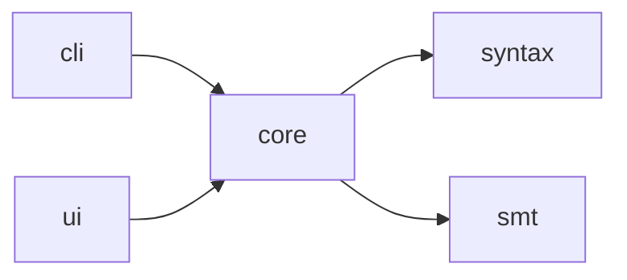

# Dependency Graph — {project_name}

> `{slug}.fact-extraction-report.md` 的配套文件。记录项目的模块/crate/包 import 结构与外部依赖。

## 内部模块图

> 每行：哪些模块 import 哪些。供 rfc-writer 设计新模块边界使用。

### 邻接表

| 模块 | 依赖（内部）| 反向依赖 |
|---|---|---|
| `intent-cli` | `intent-core` | （无 —— 栈顶）|
| `intent-core` | `intent-syntax`、`z3`（外部）| `intent-cli`、`intent-ui` |
| `intent-syntax` | （无）| `intent-core` |
| `intent-ui` | `intent-core`、`tauri`（外部）| （无 —— 栈顶）|

> 为什么两种格式：图给人粗读用；表是机器可读的事实来源。

---

## 外部依赖

### 直接依赖（声明在 {Cargo.toml / package.json / go.mod}）

| 名称 | 版本 | 用于 | License | 备注 |
|---|---|---|---|---|
| `serde` | `1.0.196` | `intent-core`、`intent-cli` | MIT/Apache | 序列化 |
| `z3` | `0.12.1` | `intent-core` | MIT | SMT 绑定 |
| ... | ... | ... | ... | ... |

### 传递依赖（精选 —— 完整列表见 lockfile）

| 名称 | 版本 | 被谁引入 | 备注 |
|---|---|---|---|
| `libloading` | `0.8` | `z3 → z3-sys` | C 库 loader |
| ... | ... | ... | ... |

### 版本约束

> 被 pin、被 yank、或剧烈变动中的依赖。帮 adr-writer 记录升级决策。

| 依赖 | 当前 | 最新 | Pin 原因 |
|---|---|---|---|
| `clap` | `4.5.0` | `4.5.27` | （无 —— 可升级）|
| `tauri` | `=2.0.0` | `2.1.x` | Pinned：2.1 已知回归（issue #X）|

---

## 外部服务调用

> 对外部系统的网络调用。基于对常见 HTTP/gRPC client 模式的 grep 得到。

| 服务 | 调用方（file:line）| 协议 | 用途 |
|---|---|---|---|
| {GitHub API} | `src/release/check.rs:42` | HTTPS | 版本检查 |
| ... | ... | ... | ... |

---

## 文件系统接触点

> 项目在自己工作目录之外读 / 写的位置。

| 位置 | 用途 | 调用方 |
|---|---|---|
| `~/.config/{app}/` | 用户配置 | `src/config/load.rs:18` |
| `/tmp/{app}-*` | 暂存文件 | `src/cache/tmp.rs:5` |

---

## Extraction Checklist

- [ ] 内部图 + 邻接表都已就位
- [ ] 直接外部依赖完整（表里没有 `…`）
- [ ] 传递依赖章节至少列出安全敏感的（FFI、网络、密码学）
- [ ] 版本约束章节为每个 pin/yank 标注理由
- [ ] 外部服务调用章节已填，或显式写 `(none — fully offline)`
- [ ] 文件系统接触点已填，或显式写 `(none)`
