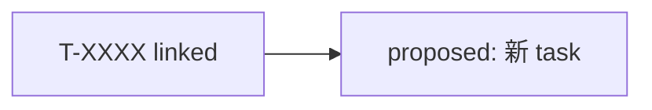

# Issue 创建报告

## Summary

[TBD: 一句话说明工作项与 pipeline 选择理由]

## Pipeline 决策

- **issue type**: [product|technical|bug|idea]
- **pipeline**: [name]
- **决策依据**: [引用 issue-author guide § Pipeline 决策树分支]

## Task 关联

### Linked（已有 task）

| task_id | 关联理由 |
|---------|----------|
| | |

### Proposed（待创建 task）

| 标题 | journey_stage | 理由 |
|------|---------------|------|
| | | |

## Issue 草稿

- **title**:
- **description**:

## 流程示意（可选）

> 跨 ≥3 个 task 或 pipeline 复杂时：`popsicle tool run mermaid-diagram action=scaffold type=flowchart`

Diagram: 工作项与 task 关系 (flowchart)



## 执行的 CLI

```bash
popsicle issue create ...
```

## Checklist

- [ ] pipeline 与 spec 覆盖情况一致
- [ ] linked task id 在 `products/<product>/tasks/` 存在
- [ ] title/description 语言符合项目配置
- [ ] 未自动 `issue start`（除非用户要求）
- [ ] 若附图：mermaid 节点为真实 task_id，语法符合 mermaid-diagrams 指南
