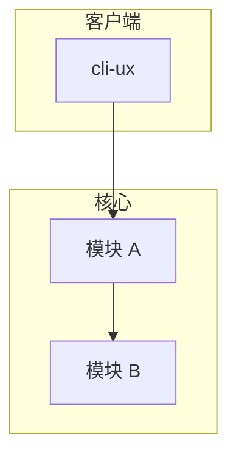
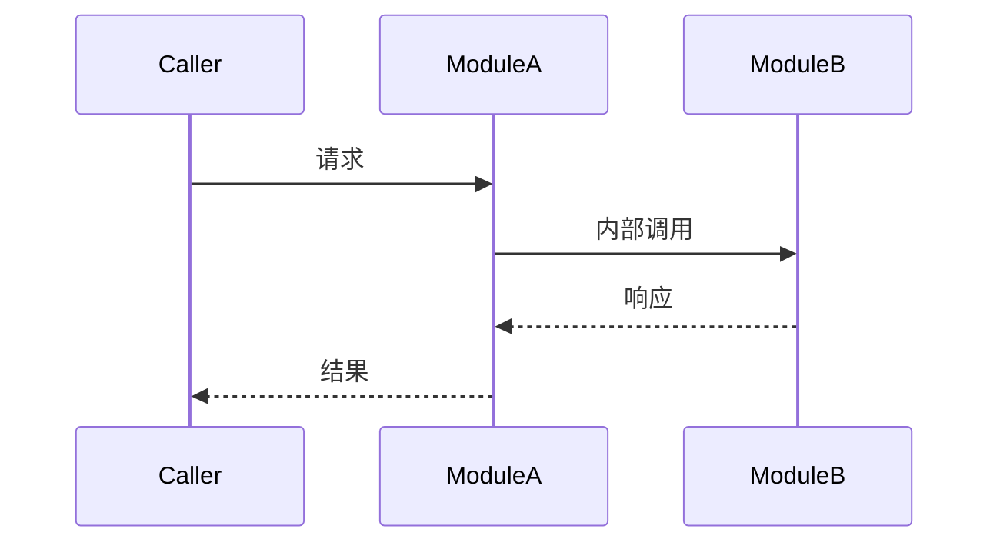

# RFC: {title}

> 正式技术设计文档。由 rfc-writer 从 arch-debate 的 rfc-draft 打磨而来，质量评分 ≥ 90。
> 现在时书写——本文 § File Manifest 列出的段落可直接合并进 ARCHITECTURE.md。
>
> **持久归宿（#15）**：本 RFC 交付后**必须**落到
> `products/<target_product>/proposals/<lifecycle>/RFC-NNNN-{slug}.md`
> （`proposed/` 或 Accepted 后 `accepted/` 原地保留），并与关联 ADR 双向相对路径回链。
> **不要**让它只停在 `.popsicle/artifacts/<run>/`——那样 spec 链跑完即丢、ADR 的
> `Related RFC` 会指向不存在的文件。

## Context

{要解决的技术问题 + 现状。legacy 模式 cite fact-extraction-report / api-contracts；greenfield 模式 cite PRD/Product Brief，超出 brief 的技术判断标 [待验证]。}

## Goals

- ……

## Non-Goals

> 明确不解决，防 scope 蔓延。

- ……

## Quality Attributes (NFR)

> 性能/容量/可用性/安全目标写在这里 + 由压测/SLO/安全评审守护。
> **不进 contracts 种子**（intent-lang 不验时间，D2）。

| 属性 | 目标 | 守护手段 |
|---|---|---|
| 延迟 p95 | …… | 压测断言 |
| 可用性 | …… | SLO 监控 |

## Proposed Design

{推荐方案：模块边界 + 数据流 + 关键接口签名。}

> **必须**至少一张图：`popsicle tool run mermaid-diagram action=scaffold type=architecture|sequence`。
> 模块边界用 `flowchart TD` + `subgraph`；主路径调用用 `sequenceDiagram`。
> 图中 crate / 模块 / 接口名须与下文 File Manifest、ADR Consequences 一致。

### 架构 / 模块图

Diagram: {系统名} 模块边界 (flowchart)

### 主路径时序（如适用）

Diagram: {场景名} 调用序列 (sequenceDiagram)

{关键接口签名、错误模型、数据契约文字说明。}

## Alternatives Considered

> 详细打分见 `{slug}.tech-decision-matrix.md`。

| 方案 | 否决理由 |
|---|---|
| 方案 B | …… |

## Intent & Decision Mapping

> 本 RFC 对下游最关键的一段：每个核心技术声明 → intent 层 + 决策载体。
> 每个 contracts 行对应 `{slug}.contracts.intent` 里的一个 goal 块。

| 核心技术声明 | 目标 intent 层 | 决策载体 | contracts goal | 备注 |
|---|---|---|---|---|
| 模块 A 对 B 暴露接口 X、保证 Y | `contracts.intent` | ADR-{id} | "A 对外提供 X" | 等 ADR Accepted 后收紧 |
| 绝不跨账户读数据 | `invariants.intent` | ADR-{id} | —— | safety + primed |
| p95 ≤ N ms | （不进 intent）| RFC § NFR | —— | D2：测试守护 |

## Risks & Mitigations

| 风险 | 触发条件 | 缓解 |
|---|---|---|
| …… | …… | …… |

## Migration / Rollout

{灰度 / 回滚 / 兼容性策略。}

## File Manifest

> 本 RFC 涉及的全部文件，落地时按此清单分别合并。与 ADR § Consequences 镜像一致。

### ARCHITECTURE.md 顶层增量
- [ ] `products/{target_product}/ARCHITECTURE.md` § {章节} — {增量内容摘要}

### Intent 文件
- [ ] `products/{target_product}/intents/contracts.intent` 追加 goal：`{goal 名}`（待 ADR-{id} 解锁后由 intent-spec-writer 收紧）

### 决策记录
- [ ] `products/{target_product}/decisions/adr/ADR-{id}-{slug}.md`（Status: Proposed → adr-writer 固化）

## Quality Checklist

- [ ] 四维度已评分，总分 ≥ 90（或 bypass 理由已记录）
- [ ] `{slug}.contracts.intent` 能 `intent check`（goal 块合法、0 VC）
- [ ] 无性能/时延误塞进 contracts（D2）
- [ ] File Manifest 与 ADR Consequences 镜像一致
- [ ] Intent & Decision Mapping 每行都有决策载体（ADR / CADR / NFR）

## References

- **Source RFC Draft**: `{slug}.rfc-draft.md`
- **Source Debate**: `{slug}.arch-debate.md`
- **Decision Matrix**: `{slug}.tech-decision-matrix.md`
- **PRD Overview**: `{slug}.prd.md`
- **Fact Basis**: api-contracts / `{slug}.fact-extraction-report.md` / PRD Overview / Product Brief
