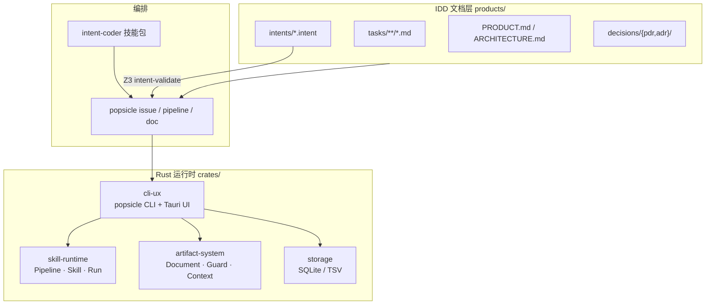

# Popsicle

> **Intent-Driven Development（IDD）** 的 spec-and-verify 运行时——把产品任务图、形式化 intent、
> pipeline 阶段文档与 Rust 实现绑在一起，让人和 AI agent 按同一套规则协作。

[](Cargo.toml)
[](https://github.com/popsicle-lab/popsicle)

---

## 这是什么

Popsicle 是 [intent-coder](intent-coder/README.md) 的**私有引擎**（[D4 决策](legacy/popsicle/intent-coder/ROADMAP.md)）：
它不是通用工作流平台，而是为 IDD 迁移与交付定制的 **Issue → Pipeline → Document → Intent 验证** 闭环。

典型用法：

1. 在 `products/<product>/` 下维护 **任务图**（`tasks/`）、**形式化契约**（`intents/*.intent`）与 **活文档**（`PRODUCT.md` / `ARCHITECTURE.md`）。
2. 用 `popsicle issue start` 启动 pipeline run，按阶段产出 artifact 文档。
3. 用 `intent-validate`（Z3）校验 intent 与实现是否一致。
4. 可选：用 **Tauri 桌面 UI** 浏览 Issue、Pipeline、文档与产品内容。

本仓库同时是 **popsicle 自身的 dogfood 场**：用 intent-coder 技能包，以 Strangler Fig 方式把 legacy 单体逐步迁到新的 crate 布局。

---

## 分支说明

本仓库是开源项目 [`popsicle-lab/popsicle`](https://github.com/popsicle-lab/popsicle)。**两条主线分支用途不同**：

| 分支 | 定位 | 适合谁 |
|---|---|---|
| **`main`**（默认）| IDD 迁移后的**新架构**：`crates/{skill-runtime,artifact-system,cli-ux,storage}` + 自托管 CLI MVP + 可选 Tauri UI | 新用户、贡献者、IDD 工作流 |
| **`backup-v0.5`** | 迁移前的 **legacy 全量 popsicle**（单体 `popsicle-core`、完整命令面、旧存储模型） | 需要对照 legacy 行为、跑 golden 对账、查阅历史实现 |

```bash
# 新架构（推荐）
git checkout main
make check && scripts/install.sh

# Legacy 对照
git checkout backup-v0.5
# 按该分支自带 README / Makefile 构建
```

`main` 通过 `legacy/popsicle/` **git submodule**（跟踪 `backup-v0.5` 分支，见 [`LEGACY_PIN.md`](LEGACY_PIN.md)）保留 legacy 全量源码，供 fact-extractor 与 equivalence baseline 对账。

---

## 架构一览



### Crate 与职责

| Crate | 职责 | 状态 |
|---|---|---|
| [`skill-runtime`](crates/skill-runtime/) | Skill 状态机、Pipeline DAG、Run/Spec、Hook、Tool/Memory 注册表 | cutover-done |
| [`artifact-system`](crates/artifact-system/) | Document 实体、Markdown guard、Context 装配、chunk 抽取 | cutover-done |
| [`storage`](crates/storage/) | 工作区持久化（SQLite `.popsicle/self-host/state.db`，兼容 legacy TSV） | 使用中 |
| [`cli-ux`](crates/cli-ux/) | `popsicle` 二进制、自托管 domain、Tauri IPC（feature `ui`） | cutover-done · dogfood-usable |

### Product 域（`products/`）

每个 product 是 IDD 文档边界（4 件套：`PRODUCT.md` / `ARCHITECTURE.md` / `intents/` / `decisions/`），**不等于**一个 Rust crate。

| Product | 说明 | 迁移状态 |
|---|---|---|
| [`skill-runtime`](products/skill-runtime/) | Pipeline/Skill 引擎灵魂 | lib 已切流 |
| [`artifact-system`](products/artifact-system/) | 文档与 guard 引擎 | 已切流 |
| [`cli-ux`](products/cli-ux/) | CLI + 桌面 UI 用户面 | 已切流（ADR-008~015）|
| [`saas-billing-module`](products/saas-billing-module/) | 示例 / 待裁决 product | pending-decision |

迁移看板：[`migration/progress.md`](migration/progress.md)

---

## 功能特性（`main` 分支）

### CLI（自托管 MVP）

| 命令族 | 能力 |
|---|---|
| `popsicle init` / `doctor` | 初始化 `.popsicle/` 工作区；校验二进制与工作区来源 |
| `popsicle issue` | create / list / show / start / **close** |
| `popsicle pipeline` | status / next / stage complete（gated stage 需 `--confirm`）|
| `popsicle doc` | create / list / show / **check**（拒绝占位符与空 checkbox）|
| `popsicle tool run intent-validate` | 对 `products/` 跑 Z3 intent 校验 |
| `popsicle admin` | migrate（TSV→SQLite）/ reinit |

- 全命令支持 `--format json`；错误同样 JSON 化并带可执行 `next` 字段。
- 完整命令面与 agent 工作流：[`AGENTS.md`](AGENTS.md)
- **Deferred**（调用返回结构化错误，不在 help 宣传）：`module` / `skill` / `spec` / `namespace` / `prompt` / `git` / `memory` / `context` / `registry` / `completions`
- **Removed**：`checklist` / `item` / `sync`

### 桌面 UI（`popsicle ui`，ADR-015）

可选 Cargo feature `ui`（Tauri 2）。IPC **直连** `LocalWorkspace`，不 subprocess CLI、不读 legacy `.popsicle/popsicle.db`。

| 页面 | 能力 |
|---|---|
| **Issues** | Issue 列表与详情、启动 run、文档列表、**工作流引导**（spec→product 推荐 task/intent）|
| **Pipeline** | 当前 run 阶段 DAG、stage complete |
| **Documents** | Stage artifact Markdown 预览 |
| **Products** | **Tasks**（全文 Markdown + frontmatter）· **Intents**（`.intent` 块级正文）· **Graph**（Task 关系图 + Intent Mermaid）|

UI 当前为**只读浏览**；编辑 task/intent 仍通过仓库与 pipeline 完成。

---

## 仓库结构

```
popsicle/
├── crates/                 # Rust 运行时（按 slice 拆分）
│   ├── skill-runtime/
│   ├── artifact-system/
│   ├── storage/
│   └── cli-ux/             # popsicle 二进制 + ui/ Tauri 桥
├── products/               # IDD 产品文档（任务图 + intent + 决策）
├── docs/                   # 仓库级 charter、baseline、invariants
├── intent-coder/           # IDD 编排技能包（10+ skills、pipeline 模板）
├── vender/intent-lang/     # intent DSL + Z3 校验工具链
├── ui/                     # Tauri 前端（Vite + React 19）
├── migration/              # Strangler Fig 进度与 traceability
├── legacy/popsicle/        # legacy 源码 submodule（对账用）
├── .popsicle/              # 本仓库自托管工作区（init 后生成）
├── AGENTS.md               # AI agent 命令指南（自动生成目标）
├── CONTRIBUTING.md         # 贡献与 IDD 硬约束
└── Makefile                # check / golden / intent / build-ui
```

文档体系铁律：[`docs/CHARTER.md`](docs/CHARTER.md)（活文档无版本号、决策只追加、编辑须引用 Decision ID）。

---

## 快速开始

### 前置要求

- Rust stable（`cargo` / `rustc`）
- 构建 UI 时另需 Node.js 18+

### macOS 安装（DMG，推荐）

1. 从 [GitHub Releases](https://github.com/popsicle-lab/popsicle/releases) 下载 `Popsicle_*_aarch64.dmg` 或 `x86_64.dmg`。
2. 挂载 DMG，将 **Popsicle.app** 拖入 **Applications**。
3. 双击 **Install CLI.command**（首次可能需右键 → 打开），CLI 安装到 `~/.local/bin`。
4. 重启终端，运行 `popsicle doctor --format json`。

未签名 DMG 首次打开需在系统设置中放行。详见 [`packaging/macos/README.md`](packaging/macos/README.md)。

### 从源码安装 CLI（开发者）

```bash
git clone https://github.com/popsicle-lab/popsicle.git
cd popsicle
git checkout main

make check                    # fmt + clippy + test（CI 同等）
scripts/install.sh            # 安装 popsicle 到 ~/.cargo/bin

popsicle init
popsicle doctor --format json # current_workspace_binary_match 应为 true
```

本地打 DMG：`make build-dmg`（仅 macOS）。

### 跑一次 IDD 工作流

```bash
popsicle issue list --format json

popsicle issue create --type technical --title "My change" --spec slice-4-ui \
  --description "What and why" --format json

popsicle issue start PROJ-NN --format json    # 返回 run_id

popsicle pipeline next --run <run_id> --format json
popsicle doc create fact-extractor --title "Facts" --run <run_id>
popsicle doc check <doc_id>
popsicle pipeline stage complete <stage> --run <run_id>

popsicle tool run intent-validate path=products
```

Bundled pipeline 模板：`greenfield-product-spec` · `slice-spec` · `slice-delivery` · `tech-decision` · `bugfix` · `migration-bootstrap`（详见 `AGENTS.md`）。

### 多项目（全局 CLI）

注册表位于 `~/.popsicle/global.json`（可用 `POPSICLE_HOME` 覆盖目录）。

```bash
cd ~/project-a && popsicle init
cd ~/project-b && popsicle init

popsicle project add ~/project-a --name a
popsicle project add ~/project-b --name b
popsicle project use a              # 设置默认项目
popsicle issue list                 # 操作 project-a

popsicle issue list --project ~/project-b   # 单次覆盖
export POPSICLE_PROJECT=~/project-b         # 或环境变量
popsicle project list
popsicle project current
```

工作区解析优先级：`--project` → `POPSICLE_PROJECT` → 默认项目 → 当前目录向上扫描。

### 桌面 UI

```bash
make build-ui                 # npm build + cargo build --features ui
./target/debug/popsicle ui [--project <workspace-path>]

# 开发热更新
make ui-dev                   # 另开终端运行 popsicle ui
```

---

## DevOps

| 命令 | 用途 |
|---|---|
| `make check` | fmt + clippy + test（`-Dwarnings`，CI 主路径）|
| `make golden` | golden-baseline 全链（legacy vs new 对账）|
| `make intent` | Z3 intent 校验 |
| `make build-ui` / `make ui-dev` | Tauri UI 构建 / 开发 |
| `make build-dmg` | macOS DMG（App + CLI + 安装脚本）|
| `make install-hooks` | pre-commit（fmt/clippy/test）|

发布：推送 `v*` tag → [`.github/workflows/release.yml`](.github/workflows/release.yml) 构建 CLI 包（4 目标）+ macOS DMG（aarch64 / x86_64）。

---

## 相关项目

| 项目 | 关系 |
|---|---|
| [intent-coder](intent-coder/README.md) | IDD 编排技能包：fact-extract → debate → PRD → RFC/ADR → intent → living-doc |
| [intent-lang](vender/intent-lang/) | `.intent` DSL 与 Z3 验证（`intent-cli` / `intent-core`）|
| Legacy popsicle（`backup-v0.5` / submodule） | 迁移前单体实现，equivalence 对账基准 |

---

## 贡献

1. 读 [`CONTRIBUTING.md`](CONTRIBUTING.md) 与 [`docs/CHARTER.md`](docs/CHARTER.md)
2. AI agent 额外读 [`AGENTS.md`](AGENTS.md)（须先 `issue start` 再写代码）
3. 改 `products/*/intents/*.intent` 须附 `intent-validate` 通过证据
4. 切流硬门禁：Z3 PASS · ≥5 golden · 切流 ADR Accepted（见 `migration/progress.md`）

---

## 许可证

- 本仓库 workspace crate：**MIT**（见各 crate `Cargo.toml`）
- `legacy/popsicle/` submodule：**Apache-2.0**

---

## 进一步阅读

| 文档 | 内容 |
|---|---|
| [`migration/progress.md`](migration/progress.md) | 切片迁移看板 |
| [`products/cli-ux/PRODUCT.md`](products/cli-ux/PRODUCT.md) | CLI/UI 用户面规格 |
| [`products/cli-ux/decisions/adr/ADR-015-tauri-ui-self-host-bridge.md`](products/cli-ux/decisions/adr/ADR-015-tauri-ui-self-host-bridge.md) | 桌面 UI 架构决策 |
| [`docs/glossary.md`](docs/glossary.md) | IDD / slice / Z3 闸等术语 |
| [`LEGACY_PIN.md`](LEGACY_PIN.md) | Legacy submodule pin 与已知限制 |
