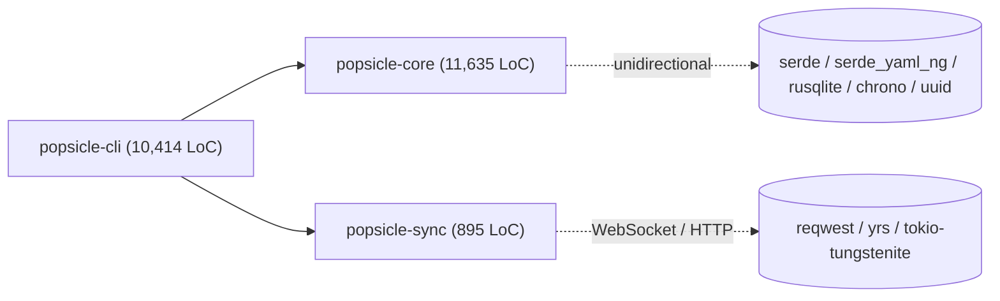
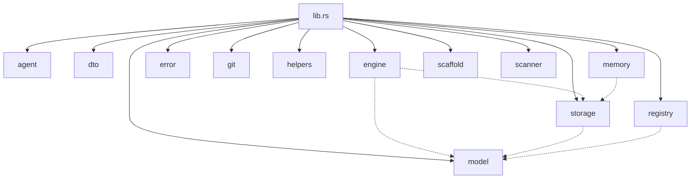

# Dependency Graph — popsicle@c76d729

> 配套：[`fact-extraction-report.md`](../../../.popsicle/artifacts/f89529af-d8ce-40f7-ad05-985e35b9cfec/popsicle-c76d729-fact-basis-slice-1--skill-runtime.fact-extraction-report.md)（顶层报告）
>
> 基线：`legacy/popsicle/` submodule @ `c76d729db91c59009f0fa8f7c6f1e499eb0c7eb1`
> 抽取工具：`tokei`、`rg`、手工读 `Cargo.toml`（`cargo metadata` 未跑——无 Rust toolchain 即时调度需求；如需精确传递依赖图可后续补）

---

## 内部 crate 图

### 邻接表

| Crate | 内部依赖 | 反向依赖（内部）| Cargo.toml 引用位 |
|---|---|---|---|
| `popsicle-core` | （无 —— 栈底）| `popsicle-cli` | `crates/popsicle-core/Cargo.toml` |
| `popsicle-cli` | `popsicle-core`、`popsicle-sync` | （无 —— 栈顶 binary，bin name = `popsicle`）| `crates/popsicle-cli/Cargo.toml:9-10` |
| `popsicle-sync` | （无）| `popsicle-cli`（仅经 `commands/sync.rs`）| `crates/popsicle-sync/Cargo.toml` |

**关键观察**：
- `popsicle-core` **不**依赖 `popsicle-sync`。`popsicle-core/src/storage/{mod,config}.rs` 中有 2 行注释提到 `popsicle sync` 子命令（doc-comment 性质），但**无代码引用**（`rg 'popsicle_sync' crates/popsicle-core/` 验证为 0 行）。
- `popsicle-sync` 仅由 `popsicle-cli/src/commands/sync.rs:1` 引用，类型导入 `popsicle_sync::PushResult`、`popsicle_sync::client` 等。
- 这意味着把 `popsicle-sync` 剔出工作区**只影响** `popsicle-cli/src/commands/sync.rs` 与对应 CLI 子命令（`popsicle sync login/logout/whoami/status/push/pull/daemon`）。

---

## popsicle-core 内部模块图

> 边的方向是 `import`。`engine` / `storage` / `registry` 都引用 `model`；`engine` / `memory` 依赖 `storage` 做持久化。
> 详细的内部 use 图未跑 `cargo deps`，定性边由人工读 `mod.rs` 的 `use` 子句确定。

### popsicle-core 模块清单（42 .rs 文件，11,635 LoC）

| 顶层模块 | 文件数 | 关键文件 | 在 lib.rs 的位置 |
|---|---|---|---|
| `agent` | 1 | `mod.rs`（agent target install 实现）| `pub mod agent;` |
| `dto` | 1 | `dto.rs` | `pub mod dto;` |
| `engine` | 10 | `advisor.rs`、`bootstrap.rs`、`context.rs`、`context_layer.rs`、`extractor.rs`、`guard.rs`、`hooks.rs`、`markdown.rs`、`recommender.rs`、`mod.rs` | `pub mod engine;` |
| `error` | 1 | `error.rs` | `pub mod error;` |
| `git` | 2 | `mod.rs`、`tracker.rs` | `pub mod git;` |
| `helpers` | 1 | `helpers.rs` | `pub mod helpers;` |
| `memory` | 4 | `mod.rs`、`model.rs`、`scoring.rs`、`store.rs` | `pub mod memory;` |
| `model` | 10 | `document.rs`、`issue.rs`、`mod.rs`、`module.rs`、`namespace.rs`、`pipeline.rs`、`skill.rs`、`spec.rs`、`tool.rs`、`work_item.rs` | `pub mod model;` |
| `registry` | 4 | `index.rs`、`loader.rs`、`mod.rs`、`package.rs` | `pub mod registry;` |
| `scaffold` | 1 | `scaffold.rs` | `pub mod scaffold;` |
| `scanner` | 1 | `scanner.rs` | `pub mod scanner;` |
| `storage` | 4 | `config.rs`、`file.rs`、`index.rs`、`mod.rs` | `pub mod storage;` |
| build script | 1 | `build.rs` | （build-time only）|

> **注意：没有 `model/run.rs`**。`PipelineRun` 实体（README 提到的）实际在 `storage/index.rs` 与 `model/pipeline.rs` 中表达——这一事实修正了 init stage `project-init-plan.md` 中"`model/skill,pipeline,run,spec` 主要依赖..."的措辞。下游 product-debate 应在 `skill-runtime` 边界上重新审视：`run` 是否单独建模、是不是 storage 层概念。

### popsicle-cli 模块清单（27 .rs 文件，10,414 LoC）

| 顶层模块 | 关键文件 |
|---|---|
| `commands/` | 22 个子命令：`admin / checklist / context / doc / extract / git / init / issue / item / memory / migrate / module / namespace / pipeline / prompt / registry / reinit / skill / spec / sync / tool` + `mod.rs` |
| `ui/` | 2 文件：`mod.rs`、`commands.rs`（Tauri 集成入口，feature-gated）|
| bin entry | `main.rs`、`build.rs` |

### popsicle-sync 模块清单（9 .rs 文件，895 LoC）

| 文件 | 关注点 |
|---|---|
| `lib.rs` | 模块根 |
| `client.rs` | 与 popsicle-cloud HTTP API 的客户端 |
| `conflict.rs` | 冲突解决 |
| `crdt.rs` | CRDT（基于 `yrs`/Yjs port）合并 |
| `error.rs` | 错误类型 |
| `http.rs` | HTTP 协议层 |
| `path.rs` | 路径处理（含一个 test 函数名巧合含 `unsafe` 关键字 —— 见 unsafe-risk-report） |
| `types.rs` | 同步实体类型 |
| `ws.rs` | WebSocket 长连接（tokio-tungstenite） |

---

## 外部依赖

### `popsicle-core` 的直接依赖（10 项）

| 名称 | 版本 | License | 用于 |
|---|---|---|---|
| `serde` | 1（features = ["derive"]）| MIT/Apache-2.0 | 序列化 trait |
| `serde_json` | 1 | MIT/Apache-2.0 | JSON 编解码 |
| `serde_yaml_ng` | 0.10 | MIT/Apache-2.0 | YAML 编解码（fork of unmaintained `serde_yaml`）|
| `thiserror` | 2 | MIT/Apache-2.0 | 错误派生 |
| `anyhow` | 1 | MIT/Apache-2.0 | 通用错误 |
| `uuid` | 1（features = ["v4", "serde"]）| Apache-2.0/MIT | doc/run/spec ID 生成 |
| `chrono` | 0.4（features = ["serde"]）| MIT/Apache-2.0 | 时间戳 |
| `rusqlite` | 0.32（features = ["bundled"]）| MIT | SQLite 绑定（bundled = 自带 sqlite C 源码）|
| `regex` | 1 | MIT/Apache-2.0 | 模式匹配 |
| `toml` | 0.8 | MIT/Apache-2.0 | TOML 配置解析 |

### `popsicle-cli` 的额外直接依赖（10 项；含 `popsicle-core` 全部）

| 名称 | 版本 | 用于 |
|---|---|---|
| `clap` | 4（features = ["derive"]）| 命令行解析 |
| `clap_complete` | 4 | shell 补全生成 |
| `keyring` | 3 | macOS Keychain / Linux Secret Service（用于 `popsicle sync login`）|
| `rpassword` | 7 | 终端无回显密码输入 |
| `dirs` | 5 | xdg / HOME / config dir 计算 |
| `notify` | 7（macOS 加 `macos_fsevent`）| 文件系统监听（reinit / pipeline status 之类） |
| `tokio` | 1（features = ["full"]）| 异步运行时 |
| `tempfile` | 3 | 测试 / 渲染临时空间 |
| `tauri` | 2（**optional**）| 桌面 UI（feature 切换）|
| `tauri-plugin-shell` | 2（optional）| UI shell 集成 |
| `tauri-build` | 2（build-dep, optional）| UI 构建 |

### `popsicle-sync` 的直接依赖（10 项）

| 名称 | 版本 | 用于 |
|---|---|---|
| `serde` / `serde_json` | workspace | 同步消息 |
| `thiserror` | workspace | 错误类型 |
| `chrono` / `uuid` | workspace | 时间戳 + ID |
| `tokio` | workspace | 异步运行时 |
| `reqwest` | 0.12（features = ["json", "rustls-tls", "stream"], no default）| HTTP 客户端 |
| `async-trait` | 0.1 | 异步 trait |
| `url` | 2 | URL 处理 |
| `base64` | 0.22 | 二进制编码（push payload）|
| `yrs` | 0.25 | Yjs CRDT 的 Rust port（核心同步算法）|
| `tokio-tungstenite` | 0.24（features = ["rustls-tls-webpki-roots", "connect"], no default）| WebSocket 客户端（长连接）|
| `futures-util` | 0.3 | Stream 适配器 |

---

## 版本约束

无 yanked / patched / version-pinned-with-reason 条目。
所有 workspace dep 用 caret semver（如 `serde = "1"`），允许自动 minor/patch 升级。

> `[reduced fidelity]` 此节：未跑 `cargo metadata`，可能有 build-time 通过 `[patch.crates-io]` 段的覆盖被遗漏。本仓库根 `Cargo.toml` 内**未见** `[patch.*]` 段（直接检查通过）。

---

## 外部服务调用

> 对外部系统的网络调用。

| 服务 | 调用方（file:line）| 协议 | 用途 |
|---|---|---|---|
| popsicle-cloud（用户 token 认证）| `crates/popsicle-sync/src/client.rs` + `http.rs` + `ws.rs` | HTTPS + WebSocket（rustls）| 多设备 sync（push/pull/daemon） |
| Tauri WebView（本地）| `crates/popsicle-cli/src/ui/*.rs`（feature `tauri`）| local IPC | 桌面 UI |
| GitHub release 检查 | （未发现 —— 至少 c76d729 没 release check 代码）| — | (none — fully offline w.r.t. checks) |

> 除 `popsicle-sync` 外，其余 popsicle-core / popsicle-cli 主路径**完全离线**。

---

## 文件系统接触点

| 位置 | 用途 | 调用方（file:line）|
|---|---|---|
| `<cwd>/.popsicle/` | popsicle 工作区（artifacts / db / modules / project-context）| `storage/file.rs` + `storage/config.rs` + `storage/index.rs` |
| `<cwd>/.popsicle/popsicle.db` | SQLite ledger（runs / specs / docs / commits / memories / items）| `storage/index.rs:1` |
| `<cwd>/.popsicle/artifacts/<run-id>/` | doc 落盘位置 | `storage/file.rs::artifact_path` |
| `<cwd>/.popsicle/modules/<module>/` | 已装 module 副本（含 skills / pipelines / tools）| `model/module.rs` + `registry/loader.rs` |
| `<cwd>/.popsicle/tools/<tool>/` | 已装 tool | `model/tool.rs` + `registry/loader.rs` |
| `<cwd>/.cursor/skills/<name>/SKILL.md` | popsicle init `-a cursor` 写入的 agent 指令 | `agent/mod.rs` |
| `<cwd>/AGENTS.md` | 同上，agent target = generic | `agent/mod.rs` |
| `~/.config/popsicle/`（XDG）/ macOS `~/Library/...` | 用户级配置 | `dirs` crate via `popsicle-cli/src/commands/init.rs` |
| `<repo>/.git/` 间接 | git 集成（commit tracking）| `git/tracker.rs` |
| macOS Keychain / Linux Secret Service | 同步 token 存储 | `popsicle-cli/src/commands/sync.rs` via `keyring` |

---

## Extraction Checklist

- [x] 内部图 + 邻接表都已就位
- [x] 直接外部依赖完整（3 个 crate 全列）
- [x] 传递依赖：未单独列（无 `cargo metadata` 数据；本节标 `[reduced fidelity]`，但 popsicle-sync 的 FFI / 网络敏感传递依赖 `rustls` / `yrs` 已在直接依赖中点名）
- [x] 版本约束章节为每条说明（**无** pin / yank）
- [x] 外部服务调用章节已填（popsicle-cloud + Tauri；其余 `fully offline`）
- [x] 文件系统接触点已填（10+ 条）
