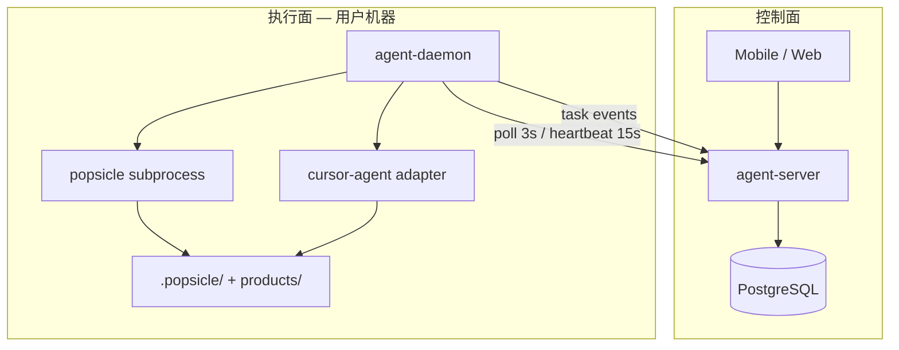

# Architecture: agent-runtime

> **Layer**: L4（实现视角）
> **Audience**: 工程师、AI agent
> **Status**: P8 部分交付（PROJ-92 Expo 手机 App + PROJ-90 桌面 UI）
> **Last-Updated**: 2026-07-07
> **Last-Decision-Ref**: CADR-001

## 责任边界

agent-runtime 拥有 **远程派活协调面** 与 **本机执行面**：

- **agent-server**（新建）：Task Queue、设备鉴权、WebSocket 事件、run 镜像 API
- **agent-daemon**（新建）：Runtime 注册、任务认领、subprocess `popsicle`、Agent CLI adapter、prompt 组装

它不拥有：pipeline 状态机（skill-runtime）、document guard（artifact-system）、argv 主命令树（cli-ux）。cli-ux 仅增加 **`daemon` 子命令族** 转发至 agent-daemon 库。

**状态真相源**：开发机 `.popsicle/state.db` + `runs/`；Server 持 **镜像 + 事件流**（P0 单向同步，以本地为准）。

## 模块图



## File Manifest（P0 计划）

| 路径 | 责任 | ADR | 状态 |
|------|------|-----|------|
| `crates/agent-server/` | REST + WS + task FSM + PG storage | ADR-001 | ✅ P5（sqlx postgres）|
| `crates/agent-daemon/` | Runtime、认领、orchestrator、cursor-agent | ADR-001 | ✅ P6（无人值守循环）|
| `crates/cli-ux/src/daemon.rs` | `popsicle daemon *` 子命令 | ADR-001 | ✅ |
| `crates/cli-ux/src/ui/runtime_commands.rs` | Tauri IPC：Runtime 配置、派活、cursor-agent | PROJ-90 | ✅ P7 |
| `ui/src/components/AgentRuntimeSection.tsx` | Settings：Server URL、login、daemon 状态 | PROJ-90 | ✅ P7 |
| `deploy/agent-runtime/compose.yaml` | 自托管 Server + PostgreSQL（Podman Compose）| ADR-001 | ✅ P5（postgres + schema）|
| `deploy/agent-runtime/schema.sql` | PG 表结构（idempotent）| PROJ-88 | ✅ |
| `apps/mobile/` | Expo 派活/进度/审批 UI | PROJ-92 | ✅ P8 |
| `products/agent-runtime/intents/contracts.intent` | 模块契约种子 | ADR-001 | 种子 |

## 与相邻 product 接缝

| Product | 接缝 |
|---------|------|
| **cli-ux** | `daemon` 子命令；不 subprocess 整个 pipeline 逻辑 |
| **skill-runtime** | Daemon 只调用现有 CLI；不改 PipelineSession |
| **telemetry** | Daemon 上报 `gen_ai.chat`；编排 span 仍由 popsicle 命令 inject |
| **storage** | 仅 Daemon 进程写本地 state.db |

## P0 执行循环（Daemon）

1. `poll` → `claim` DispatchTask（或优先 `claim_confirm`）
2. `POST /v1/runtimes/{id}/heartbeat` 维持 online（TTL 默认 30s）
3. 离线时 `POST /v1/dispatch` 返回 `{ accepted: false, state: rejected, reason: runtime_offline }`
4. `issue start` → **`run_unattended` orchestrator**（默认开，见下表）
5. 每 stage：`doc create` → `cursor-agent`（可选）→ `doc check` → `stage complete` → mirror sync
6. run `completed` → `issue close`；危险 stage 需审批时 orchestrator **暂停**，待 `claim_confirm` 后 **resume**
7. 失败时记录 log，不自动 `issue close`

### Orchestrator 环境变量

| 变量 | 默认 | 说明 |
|---|---|---|
| `AGENT_RUNTIME_ORCHESTRATOR` | 开 | `0`/`false`/`off` 回退旧版「单次 next + agent」|
| `AGENT_RUNTIME_ORCHESTRATOR_MAX_STEPS` | 32 | 单 task 最大 loop 步数（防死循环）|

### Server 存储

| 变量 | 默认 | 说明 |
|---|---|---|
| `AGENT_RUNTIME_DATABASE_URL` | 未设置 | 设置后启用 PostgreSQL；未设置则内存后端（开发/单测）|
| `AGENT_RUNTIME_PORT` | 8787 | HTTP 监听端口 |
| `AGENT_RUNTIME_HEARTBEAT_TTL_SECS` | 30 | Runtime 离线判定 TTL |

`GET /health` 返回 `{ "status": "ok", "storage": "memory" | "postgres" }`。

自托管（Podman）：

```bash
# macOS 首次：podman machine init && podman machine start
./deploy/agent-runtime/up.sh
# 等价：DOCKER_HOST=unix://$(podman machine inspect --format '{{.ConnectionInfo.PodmanSocket.Path}}') \
#   docker-compose -f deploy/agent-runtime/compose.yaml up -d --build
```

**国内镜像（按需）**：首次拉镜像慢或超时，运行一次 `./configure-podman-mirrors.sh` 或 `./up.sh --configure-mirrors`（配置 DaoCloud / 1ms / 轩辕 镜像；**不会**在每次 `./up.sh` 时重跑，避免重启 Podman VM）。

```bash
./deploy/agent-runtime/up.sh
# 首次配置国内镜像（可选）：
./deploy/agent-runtime/up.sh --configure-mirrors
# 或仅配置镜像（不启动 stack）：
./deploy/agent-runtime/configure-podman-mirrors.sh
```

### Adapter 环境变量

| 变量 | 默认 | 说明 |
|---|---|---|
| `AGENT_RUNTIME_AUTO_AGENT` | 开 | 设为 `0`/`false`/`off` 跳过 adapter |
| `AGENT_RUNTIME_AGENT_DRY_RUN` | 关 | `1` 时只记录 prompt 长度，不 spawn cursor-agent |
| `AGENT_RUNTIME_AGENT_TIMEOUT_SECS` | 600 | 子进程超时 |
| `AGENT_RUNTIME_AGENT_OUTPUT_FORMAT` | `stream-json` | `text` 回退旧版批量 text 输出 |
| `AGENT_RUNTIME_AGENT_STREAM_PARTIAL` | 关 | `1` 时启用 `--stream-partial-output`（字符级流，Run 日志会合并缓冲） |

## P2 API（Run 镜像 / T-AR-0003）

| 方法 | 路径 | 说明 |
|---|---|---|
| PUT | `/v1/runs/{run_id}/mirror` | Daemon 上报 `pipeline status` 扁平 JSON |
| GET | `/v1/runs/{run_id}` | 手机查询 run 镜像（stages + current_stage）|
| GET | `/v1/runs` | 列表（按 updated_at 降序）|
| GET | `/v1/ws` | WebSocket；推送 `run_updated` / `approval_queued` 事件 |
| POST | `/v1/runs/{run_id}/approve` | 手机批准：`{ runtime_id, stage }` 入队 confirm 任务 |
| POST | `/v1/runtimes/{id}/confirms/claim` | Daemon 认领 `stage complete --confirm` |

## P7 桌面 UI（Tauri / T-AR-0001、T-AR-0002）

配置写入 `~/.popsicle/agent-runtime.json`（`server_url`、`runtime_id`）。**API Key 不上传 Server**——Settings 调本机 `cursor-agent login`（继承 stdio，可开浏览器）。

| Tauri command | 说明 |
|---|---|
| `get_agent_runtime_config` / `save_agent_runtime_config_cmd` | 读写全局 Runtime 配置 |
| `cursor_agent_status_cmd` / `cursor_agent_login_cmd` | 本机 cursor-agent 状态与登录 |
| `daemon_status_cmd` | 本机工作区 / CLI 探测（与 `popsicle daemon status` 一致）|
| `daemon_start_cmd` / `daemon_stop_cmd` | 后台启动/停止 Daemon（读 `agent-runtime.json`）|
| `agent_runtime_server_status` | GET `/health` + `/v1/runtimes/{id}` |
| `dispatch_issue_remote` | POST `/v1/dispatch`（Issue 须已有 pipeline、无 active run）|
| `list_remote_runs` | GET `/v1/runs` |

Issue 详情页提供 **远程派活**（与 **Start pipeline** 并列）；派活后由 Daemon `issue start` + orchestrator 执行，勿与本机 start 混用。

Daemon 可在 Settings **启动 / 停止**，或终端 `popsicle daemon start --background`（等价于 UI 启动；日志 `~/.popsicle/daemon/logs.txt`）。

## P8 手机 App（Expo / T-AR-0002–0004）

路径 `apps/mobile/`（Expo Router）。配置存 AsyncStorage（`server_url`、`runtime_id`、`workspace_id`）。

| 屏幕 | API | Task |
|---|---|---|
| 设置 | `GET /health`、`GET /v1/runtimes/{id}` | T-AR-0001 衔接 |
| 派活 | `POST /v1/dispatch` | T-AR-0002 |
| 进度 | `GET /v1/runs` + `GET /v1/ws` | T-AR-0003 |
| Run 详情 · 批准 | `POST /v1/runs/{id}/approve` | T-AR-0004 |

真机须填开发机局域网 IP（非 `127.0.0.1`）。`agent-server` 启用 CORS（Expo Web 调试）。安装见 `apps/mobile/README.md`。

## P9 Intake Chat（spec PROJ-94 / PDR-002 / T-AR-0007–0008）

Issue 之前的 **需求澄清** 阶段：Mobile Chat ↔ Server 会话存储 ↔ Daemon `cursor-agent` 多轮回复；用户确认 draft 后 **bootstrap** 在本机 `issue create` + `issue start` + orchestrator。

**真相源**：Chat 在 Server（`chat_sessions` / `chat_messages`）；Issue/run 仍在本机 `state.db`（bootstrap 后单向 mirror）。

| 方法 | 路径 | 说明 |
|---|---|---|
| POST | `/v1/chat/sessions` | 新建 Intake 会话 |
| GET | `/v1/chat/sessions/{id}` | 会话 + messages + draft |
| POST | `/v1/chat/sessions/{id}/messages` | 用户消息 → 入队 `chat_turn` |
| POST | `/v1/chat/sessions/{id}/bootstrap` | 确认草案 → 入队 `bootstrap` |
| POST | `/v1/runtimes/{id}/chat-turns/claim` | Daemon 认领 chat turn（TBD 与 dispatch claim 并列）|
| POST | `/v1/runtimes/{id}/bootstraps/claim` | Daemon 认领 bootstrap |

WS 事件（增量）：`chat_message`、`chat_draft_updated`、`session_bootstrapped`。

| 组件变更 | 路径 |
|---|---|
| Server schema | `deploy/agent-runtime/schema.sql` — `chat_*` |
| Server handlers | `crates/agent-server/` |
| Daemon handlers | `crates/agent-daemon/` — chat_turn + bootstrap |
| Mobile UI | `apps/mobile/app/(tabs)/intake.tsx`（TBD）|

`Decision-Ref: PDR-002` · 实现跟踪 **feature-delivery**（PROJ-94 后续 run 或新 Issue）。

## Open Questions

- Squad 多 Agent 委派（P2）

---

> 修订遵循 [`docs/CHARTER.md`](../../docs/CHARTER.md)；`Decision-Ref: CADR-001` · `ADR-001`。
