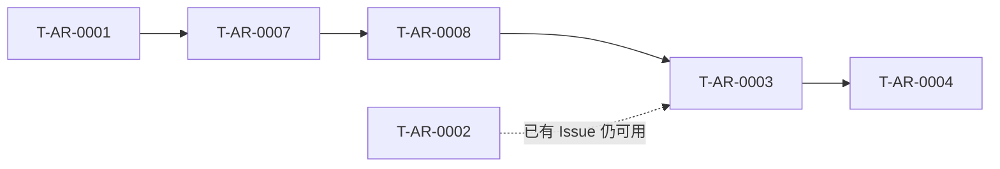

# PRD Overview — 手机需求 Chat Intake 与立项派活

> **Status**: Review
> **Target Product**: `agent-runtime`
> **Source Debate**: `[未经辩论]`
> **PDR**: `PDR-002-mobile-intake-chat.md`
> **Quality Score**: 92/100
> **Last-Updated**: 2026-07-07

---

## 1. 本次变更的核心意图

用户在 Mobile 上尚 **没有 PROJ-xx** 时，可通过多轮 Chat 与 Agent 实时澄清需求；确认摘要后 Daemon 在本机 **创建 Issue 并启动 pipeline**，之后与 P8 派活/进度/审批路径一致。

---

## 1b. 旅程与 Task 关系

---

## 2. Problem Statement（合并到 PRODUCT.md）

**Current Situation**：Mobile 只能对已有 Issue 派活；需求初期对话只能在 Cursor IDE 进行。

**Proposed Solution**：增加 Intake Chat 阶段（Server 存会话，Daemon 跑 Agent）；bootstrap 在本机 `issue create` + `issue start` + orchestrator。

**Business Impact**：手机可覆盖「从一句话到 pipeline running」的主路径，仍保持 IDD 与单真相源。

`Decision-Ref: PDR-002`

---

## 3. Success Metrics

| Metric | Baseline | Target | Measurement |
|---|---|---|---|
| Chat 首条 assistant 回复 | 无 | online 时 60s 内 | dogfood |
| bootstrap → run in_progress | 无 | 1 次端到端 | pipeline status |
| 错误 pipeline 被用户改掉 | — | 可编辑 draft | UX 验收 |

`Decision-Ref: PDR-002`

---

## 4. 文件清单

### 新增 Tasks

| Task ID | 标题 | Journey | 路径 |
|---|---|---|---|
| T-AR-0007 | 手机 Chat 澄清需求 | onboarding | `tasks/onboarding/T-AR-0007-mobile-intake-chat.md` |
| T-AR-0008 | 确认摘要并 bootstrap | daily-ops | `tasks/daily-ops/T-AR-0008-bootstrap-issue-from-chat.md` |

### PDR

- `decisions/pdr/PDR-002-mobile-intake-chat.md`

### Acceptance 种子

见 artifact `mobile-intake-chat.acceptance.intent` 与 intent-spec 合并结果。

---

## 5. User Intents Catalog 增量

| User Query | → Task | Journey |
|---|---|---|
| 「手机上怎么一句话开始需求？」 | T-AR-0007 | onboarding |
| 「Chat 和派活有什么区别？」 | T-AR-0007 | onboarding |
| 「聊完怎么自动建 Issue？」 | T-AR-0008 | daily-ops |

---

## 6. Intent Mapping

| # | 声明 | 层 | Task | block |
|---|---|---|---|---|
| 1 | online 时 chat turn 入队成功 | acceptance | T-AR-0007 | ChatTurnQueuedWhenRuntimeOnline |
| 2 | offline 时 chat turn 拒绝 | acceptance | T-AR-0007 | ChatTurnRejectedWhenRuntimeOffline |
| 3 | bootstrap 后本机有 Issue 且 run 启动 | acceptance | T-AR-0008 | BootstrapCreatesIssueAndRun |
| 4 | Chat/Bootstrap REST 面存在 | contracts | T-AR-0007/0008 | ChatIntakeApiSurface |

---

## 7. Out of Tasks

- ❌ Multica 桥接
- ❌ Server 直接写 `state.db`
- ❌ Chat 阶段直接改仓库代码（implement 仍在 pipeline）
- ❌ 替代 issue-author 全部 CLI 硬门禁（仍由 popsicle CLI  enforcement）

`Decision-Ref: PDR-002`

---

## 8. Charter Compliance Self-Check

- [x] 文件清单与 PDR Consequences 一致
- [x] Task 文件已单独落地
- [x] Intent Mapping 与 acceptance 种子对应
- [x] CADR-001：仍收敛到 popsicle Issue + pipeline
