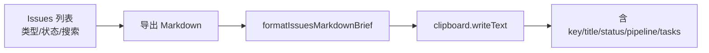

# 我导出当前筛选的 Issue 列表 Markdown 简报

## 本 task 可解答

- "怎么把当前筛选的 Issue 列表导出成 Markdown？"
- "导出简报里有没有 linked task？"
- "导出是否尊重类型/状态/搜索筛选？"

## 前提与限制

在 Popsicle 桌面端 **Issues** 页操作。导出内容来自前端已筛选/排序的列表，写入系统剪贴板。

## 流程示意

## 完成路径

1. 打开 Issues 页，设置类型、状态、搜索框。
2. 可选切换「按产品 / 按 Task」视图（写入简报元数据）。
3. 点击 **导出 Markdown**。
4. 粘贴到笔记或 IM，核对表格与明细段。

## 可观察的成功标志

- 简报标题 `# Issue 列表简报`，含导出时间与筛选说明。
- 条数与当前 UI 列表一致。
- 每条含 pipeline 与 linked task id（若有）。

## Related Next Tasks

- T-CU-0004

## Charter Compliance

- Spec：`PDR-004` + `ADR-024` File Manifest；验收 `IssueExportMarkdownBrief`。
